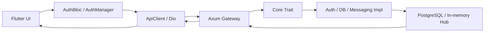

# Bài Giảng Kiến Trúc Trong EvoBase

Bài này giải thích kiến trúc của EvoBase theo góc nhìn người sắp lên senior:

- hệ thống được chia theo boundary nào
- dependency đi từ đâu tới đâu
- mỗi crate / package chịu trách nhiệm gì
- vì sao các layer này giúp dự án dễ mở rộng hơn

## 1. Kiến Trúc Tổng Thể

EvoBase đi theo hướng layered / clean architecture khá rõ:

- `apps/evobase-server` là composition root.
- `crates/evobase-gateway` là HTTP adapter.
- `crates/evobase-core` là domain contracts và types.
- `crates/evobase-auth` là implementation cho auth.
- `crates/evobase-db` là implementation cho storage / PostgreSQL.
- `crates/evobase-messaging` là implementation cho messaging in-memory.
- `crates/evobase-protocol` là wire DTOs.
- `apps/evobase_workbench` là client UI và client-side architecture.

Sơ đồ phụ thuộc nên đọc cùng:

- `docs/diagrams/01_component_overview.puml`
- `docs/diagrams/07_core_contracts_class.puml`
- `docs/diagrams/06_runtime_deployment.puml`

## 2. Luồng Dependency Đúng

Nguyên tắc cơ bản của repo là:

- `core` không phụ thuộc vào framework web hay DB.
- `gateway` phụ thuộc vào `core` và `protocol`.
- `auth`, `db`, `messaging` phụ thuộc vào `core`.
- `server` chỉ ghép các implementation lại.
- Flutter client phụ thuộc vào protocol mirror và client wrapper.

Đây là điểm rất quan trọng:

- business rule nằm gần `core`
- adapter nằm ở vòng ngoài
- wiring nằm ở composition root

Nếu sau này thay `axum` bằng framework khác, hoặc thay `PostgresStorage` bằng một adapter khác, ảnh hưởng sẽ được giới hạn khá tốt.

## 3. Vai Trò Từng Crate

### `evobase-core`

Đây là nơi đặt:

- trait contract: `AuthService`, `StorageAdapter`, `MessagingService`
- domain types: `QualifiedTable`, `TableSelect`, `TableInsert`, `TableUpdate`, `TableDelete`
- config structs
- error type chuẩn hóa: `AppError`
- docs metadata cho API docs / RLS

Điểm mạnh:

- không có dependency framework nặng
- ít bị "dính" vào HTTP hoặc DB implementation
- dễ test logic ở mức contract

### `evobase-protocol`

Đây là lớp wire format:

- request DTO
- response DTO
- envelope `ApiResponse<T>`
- error envelope
- DTO cho docs và REST body

Lợi ích:

- backend và Flutter có cùng hình dạng dữ liệu ở tầng wire
- tránh để handler trả raw domain type ra ngoài
- conversion rõ ràng bằng `From`

### `evobase-gateway`

Đây là HTTP adapter:

- route assembly
- middleware auth
- handler parse request
- map domain result sang protocol DTO

Nói ngắn gọn:

- gateway không nên chứa business logic
- gateway chỉ là "dịch" HTTP sang domain và ngược lại

Files đáng đọc:

- `crates/evobase-gateway/src/routes.rs`
- `crates/evobase-gateway/src/middleware.rs`
- `crates/evobase-gateway/src/handlers/auth.rs`
- `crates/evobase-gateway/src/handlers/rest.rs`
- `crates/evobase-gateway/src/handlers/docs.rs`
- `crates/evobase-gateway/src/handlers/messaging.rs`

### `evobase-auth`

Xử lý:

- hash password bằng `argon2`
- issue JWT bằng `jsonwebtoken`
- verify access / refresh / notification token
- build `TokenBundle`

Đây là domain service implementation, không phải HTTP concern.

### `evobase-db`

Xử lý:

- connection pool PostgreSQL bằng `sqlx`
- CRUD động cho `/rest/{table}`
- describe tables cho API docs
- gắn auth context vào DB session để hỗ trợ RLS

Đây là nơi logic "data access + security at DB boundary" sống.

### `evobase-messaging`

Xử lý:

- connect / disconnect user sessions
- fan-out message tới nhiều kết nối
- queue offline event
- cleanup message hết hạn

Trong kiến trúc này nó đóng vai trò event hub in-memory.

### `evobase_workbench`

Frontend không chỉ là UI, mà là một kiến trúc con:

- `client/core/api_client.dart`: wrapper HTTP + error mapping
- `client/auth/auth_manager.dart`: orchestration auth
- `client/auth/token_storage.dart`: local persistence
- `client/api/*.dart`: thin API clients
- `app/blocs/auth/*`: state management
- `app/pages/*`: view layer

Đây là mô hình rất hợp với team có xu hướng tách concerns rõ ràng.

## 4. Composition Root Làm Gì

`apps/evobase-server/src/main.rs` là nơi ghép mọi thứ lại:

1. đọc config
2. connect DB
3. tạo auth service
4. tạo messaging hub
5. build `AppState`
6. build router
7. start server

Điểm quan trọng:

- `main.rs` không nên chứa business logic
- nó chỉ quyết định implementation nào được dùng
- đây là nơi dễ thay thế dependency nhất

## 5. Request Lifecycle

Một request đi theo chuỗi này:

Điểm đáng học:

- UI không biết DB.
- Gateway không biết chi tiết DB.
- Core không biết framework web.
- Protocol giữ wire format ổn định.

## 6. Vì Sao Có `protocol` Riêng

Nhiều dự án để DTO lẫn vào handler.

Repo này tách hẳn `evobase-protocol` ra để:

- tránh coupling giữa HTTP layer và domain layer
- giữ response shape ổn định cho client
- dễ mirror sang Dart models

Trên Flutter side, các model trong:

- `apps/evobase_workbench/lib/client/models/*.dart`

mirror gần như 1-1 với protocol crate.

Đây là chiến lược rất tốt khi backend và frontend phát triển cùng nhau.

## 7. Tại Sao `AppState` Quan Trọng

`crates/evobase-gateway/src/state.rs` giữ:

- `auth_service`
- `messaging_service`
- `storage`
- `admin_token`

`AppState` là boundary của dependency injection.

Điểm hay:

- handler lấy state từ một chỗ duy nhất
- dễ mock service khi test
- route layer không tự tạo dependency mới

## 8. Middleware Là Boundary Của Security

`crates/evobase-gateway/src/middleware.rs` phân chia rõ:

- `require_access_token`
- `require_admin_token`

Đây là quyết định kiến trúc tốt vì:

- auth policy không bị lặp ở mọi handler
- handler sau middleware chỉ thấy `AuthContext`
- admin path được cô lập rõ hơn

## 9. RLS Là Một Phần Của Kiến Trúc, Không Chỉ Là Database Trick

Trong `crates/evobase-db/src/postgres.rs`, auth context được set vào session bằng `set_config(...)`.

Ý nghĩa kiến trúc:

- authorization không chỉ nằm ở app layer
- DB cũng enforce được policy
- nếu app layer bị bug, DB vẫn là lớp bảo vệ thứ hai

Sơ đồ liên quan:

- `docs/diagrams/02_auth_rls_sequence.puml`
- `docs/diagrams/10_data_model_erd.puml`

## 10. REST Tự Sinh Từ Metadata

Điểm rất thú vị của EvoBase là `/docs` không phải tài liệu viết tay thuần túy.

`evobase-db` đọc metadata từ Postgres:

- columns
- grants
- RLS enabled
- policies

Sau đó build:

- `TableDoc`
- `QueryDoc`
- `TableMethods`

Kiến trúc này tạo ra một "self-describing API".

Lợi ích:

- client có thể hiểu table nào hỗ trợ gì
- docs bám sát thực tế DB
- khi schema đổi, docs đổi theo

## 11. Frontend Kiến Trúc Theo Tầng

Workbench cũng có layering rõ:

- `ApiClient`: low-level HTTP
- `AuthManager`: nghiệp vụ auth cho client
- `TokenStorage`: persistence
- `AuthBloc`: orchestration UI state
- `LoginPage` / `HomePage`: view

Điều này giúp:

- page không phải biết token refresh
- manager không phải biết widget tree
- bloc trở thành nơi rất dễ test

### Lưu ý thực tế

Trong `pubspec.yaml` có một số dependency như `retrofit`, `build_runner`, `hive`.
Nhưng code hiện tại chủ yếu đang dùng:

- `dio`
- `flutter_bloc`
- `shared_preferences`
- `json_annotation`
- `logger`

Nên khi đọc kiến trúc, hãy phân biệt:

- dependency đã khai báo
- dependency đang thực sự nằm trên critical path

## 12. Cách Mở Rộng Mà Không Làm Vỡ Kiến Trúc

### Thêm một endpoint mới

1. Định nghĩa hoặc cập nhật type ở `evobase-core`.
2. Nếu request/response cần wire shape, thêm DTO ở `evobase-protocol`.
3. Implement handler ở `evobase-gateway`.
4. Nếu cần persistence, thêm logic ở `evobase-db`.
5. Nếu có security policy, cân nhắc middleware hoặc RLS.
6. Nếu Flutter cần dùng, mirror model và API client tương ứng.

### Thêm một service mới

1. Tạo trait trong `evobase-core`.
2. Tạo implementation ở crate riêng.
3. Inject vào `AppState`.
4. Route / handler chỉ dùng trait.

Đây là cách giữ repo không bị "spaghetti dependency".

## 13. Red Flags Khi Codebase Bắt Đầu Xấu Đi

- Handler có nhiều business logic.
- Gateway query SQL trực tiếp thay vì đi qua storage/service.
- Core bắt đầu import axum hoặc sqlx.
- DTO và domain type bị trộn.
- Token handling nằm rải rác ở nhiều chỗ.
- Async lock bị giữ qua `await`.
- Flutter page tự gọi HTTP và tự lưu token.

Nếu gặp các dấu hiệu này, kiến trúc đang rò rỉ boundary.

## 14. Bài Tập Tự Học

1. Vẽ lại dependency graph của repo bằng lời.
2. Chỉ ra file nào là composition root, file nào là adapter, file nào là domain.
3. Trace một request `/rest/{table}` và đánh dấu các boundary chuyển đổi dữ liệu.
4. So sánh `evobase-core` với `evobase-protocol`: cái nào là "meaning", cái nào là "shape".
5. Tìm một nơi có thể thêm feature mới mà không phải sửa quá nhiều file ở core.

## 15. Tóm Tắt Một Câu

Kiến trúc của EvoBase được thiết kế để:

- domain đứng ở giữa
- adapter nằm bên ngoài
- request/response đi qua DTO rõ ràng
- async được kiểm soát ở từng boundary
- frontend và backend nói cùng một ngôn ngữ dữ liệu
