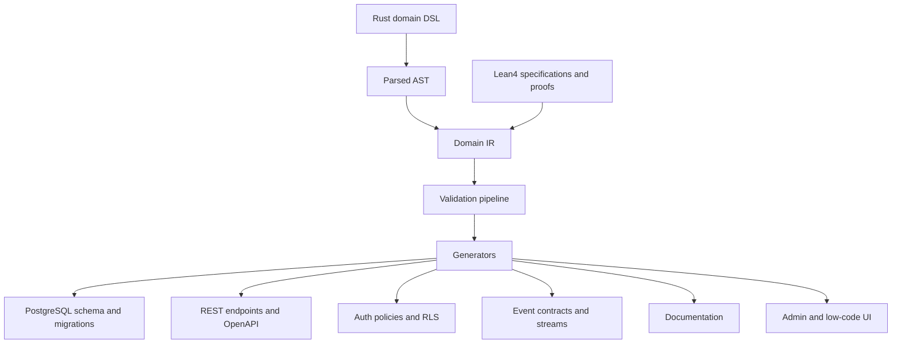

# EvoBase Redesign Vision

This handbook describes EvoBase as a domain-driven low-code platform with a
verification-first architecture. It is intentionally documentation only. It does
not define runtime code, migrations, or crate-level implementation tasks.

The current EvoBase direction can be summarized as:

```text
Database -> REST Gateway -> Auth -> Messaging
```

The next EvoBase direction is:

```text
Domain Model -> Verified Specification -> Generated Runtime
```

The domain model becomes the single source of truth. PostgreSQL schemas, SQL
migrations, REST endpoints, auth policies, row-level security policies,
messaging contracts, documentation, workflow definitions, admin interfaces, and
low-code UI surfaces are all derived from the same verified model.

## Why Redesign

The existing system follows a PostgREST-inspired model. This is valuable for
fast CRUD APIs over PostgreSQL, but it makes the database schema the effective
product language. That works until the product needs to express business
workflows, invariants, domain events, authorization semantics, and generated
client experiences as first-class concepts.

The redesign keeps the practical strengths of the current architecture:

- Rust as the implementation language.
- PostgreSQL as a strong transactional store.
- JWT and RLS as useful enforcement tools.
- SSE as a simple real-time delivery mechanism.
- Generated documentation and discoverability.

The redesign changes the source of truth:

- Current: PostgreSQL table structure is introspected and exposed.
- Target: A verified domain specification generates PostgreSQL and every other
  boundary artifact.

## Product Thesis

EvoBase should become a domain definition platform, not merely a backend
framework.

Backend frameworks ask developers to write handlers, schemas, permissions, SQL,
events, and docs in multiple places. EvoBase should ask teams to define the
business domain once, verify the dangerous invariants, and generate the rest.

This enables two audiences to collaborate:

- Engineers define verified foundations, generators, extension points, and
  reviewable domain packages.
- Business analysts and product operators refine entities, workflows, policies,
  projections, and forms through generated low-code UIs without escaping the
  verified domain model.

The platform is low-code because most runtime artifacts are generated. It is
not low-rigor. The more critical the rule, the closer it should live to the
verified specification.

## Architectural Promise

The promise is:

> If a business rule can be modeled as a type, proof, policy, or workflow
> transition, EvoBase should make invalid usage difficult or impossible.

This is the practical meaning of "illegal states should be unrepresentable."

Examples:

- A `NonEmptyString` cannot be silently stored as an empty value.
- A `VerifiedUserId` cannot be confused with an unverified `UserId`.
- An `Order<Paid>` cannot be shipped before the `pay` transition.
- A refund command cannot be exposed unless its policy can be derived.
- A domain event cannot be published with a payload that violates its contract.

Not every invariant can be proven statically. The architecture therefore uses a
layered guarantee model:

1. Lean4 specifications prove deep invariants for critical concepts.
2. Rust DSL typing and macros reject invalid domain declarations early.
3. Domain IR validation catches graph-level inconsistencies.
4. Generated runtime validators handle external data and boundary input.
5. Generated PostgreSQL constraints and RLS provide final enforcement.

See [04_lean4_verification.md](04_lean4_verification.md) and
[03_refinement_types.md](03_refinement_types.md).

## Source Of Truth

The source of truth is a domain package:



The Rust DSL provides the ergonomic authoring surface. Lean4 provides the
specification and proof surface. The Domain IR is the central abstraction that
all generators consume.

## Generated Artifacts

Generated artifacts include:

- PostgreSQL schemas.
- SQL migrations.
- REST endpoints.
- OpenAPI documents.
- Auth policy declarations.
- PostgreSQL RLS policies.
- Messaging contracts.
- SSE stream contracts.
- Workflow transition definitions.
- Projection and read-model definitions.
- Documentation.
- Admin UI metadata.
- Low-code UI metadata.

Generation must be deterministic, diffable, and explainable. Every generated
artifact should point back to the domain declaration that caused it. Generator
architecture is covered in [09_generator_architecture.md](09_generator_architecture.md).

## Design Principles

### Domain First

The domain model is not a passive database schema. It expresses entities, value
objects, aggregates, commands, queries, domain events, workflows, projections,
read models, and policies. See [02_domain_language.md](02_domain_language.md).

### Verification First

Verification is not a QA phase after runtime code exists. Verification shapes
the domain language itself. Lean4 specifications define the strongest version of
critical invariants. Rust and SQL receive generated constraints from those
specifications. See [04_lean4_verification.md](04_lean4_verification.md).

### IR Centered

Generators should not parse Rust syntax independently. The only stable contract
between authoring and generation is the Domain IR. The IR contains the metadata
model, type graph, workflow graph, policy graph, and event graph. See
[05_domain_ir.md](05_domain_ir.md).

### Typed Boundaries

Every external boundary must be treated as untrusted. Requests, JWT claims,
messages, UI forms, and imported data are parsed into refined domain values
before being admitted. The same refinements inform generated database
constraints and API schemas.

### Workflows Are First Class

CRUD is an implementation detail, not the business model. Workflows define
allowed state transitions and generated endpoints. An endpoint should represent
a command such as `pay_order` or `ship_order`, not merely a table update when a
workflow invariant matters. See [06_workflow_system.md](06_workflow_system.md).

### Authorization Is Domain Semantics

Authorization is not only roles. EvoBase must support actors, roles,
capabilities, policies, permissions, and resources. Roles may grant default
capabilities, but capabilities and policies decide action-level authority. See
[07_auth_model.md](07_auth_model.md).

### Events Are Domain Facts

Messaging is not generic notification delivery. Domain events describe facts
that happened inside the model. The event bus, projections, realtime streams,
and future Kafka compatibility are derived from those facts. See
[08_messaging_model.md](08_messaging_model.md).

### Theory Must Pay Rent

Functional programming and category theory are used only where they clarify
architecture:

- Algebraic data types model domain alternatives.
- Composition builds validators, generators, and workflows.
- Functors map IR into target artifacts.
- Natural transformations convert one generator interpretation into another.
- Free structures separate declaration from interpretation.

See [11_category_theory_mapping.md](11_category_theory_mapping.md) and
[12_functional_programming_mapping.md](12_functional_programming_mapping.md).

## Non-Goals For This Handbook

This handbook does not:

- Define final Rust crate names.
- Write procedural macro implementation code.
- Write SQL migrations.
- Build a runtime workflow engine.
- Replace all current EvoBase APIs immediately.
- Specify a complete Lean4 standard library for the project.

It defines the target architecture and design vocabulary for the next
generation of EvoBase.

## Handbook Map

- [01_architecture_overview.md](01_architecture_overview.md): end-to-end system
  view.
- [02_domain_language.md](02_domain_language.md): Rust DSL and DDD model.
- [03_refinement_types.md](03_refinement_types.md): refined values and
  invariant flow.
- [04_lean4_verification.md](04_lean4_verification.md): Lean4 specification and
  proof strategy.
- [05_domain_ir.md](05_domain_ir.md): central intermediate representation.
- [06_workflow_system.md](06_workflow_system.md): typestate workflows.
- [07_auth_model.md](07_auth_model.md): actor, capability, and policy model.
- [08_messaging_model.md](08_messaging_model.md): domain events and streams.
- [09_generator_architecture.md](09_generator_architecture.md): generation
  boundaries and artifacts.
- [10_low_code_platform.md](10_low_code_platform.md): low-code product vision.
- [11_category_theory_mapping.md](11_category_theory_mapping.md): practical
  category theory mapping.
- [12_functional_programming_mapping.md](12_functional_programming_mapping.md):
  functional programming mapping.
- [13_migration_strategy.md](13_migration_strategy.md): path from current
  EvoBase.
- [14_open_questions.md](14_open_questions.md): unresolved design questions.
