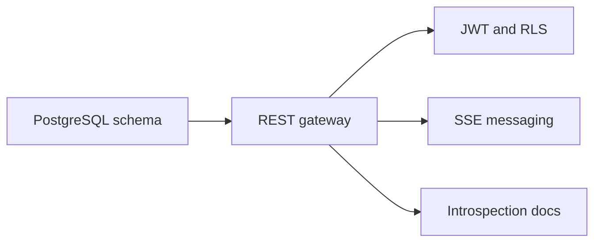
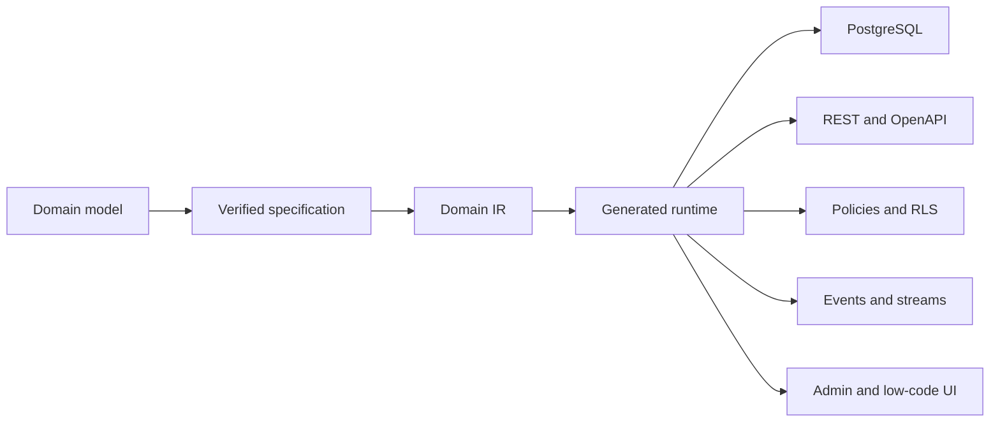
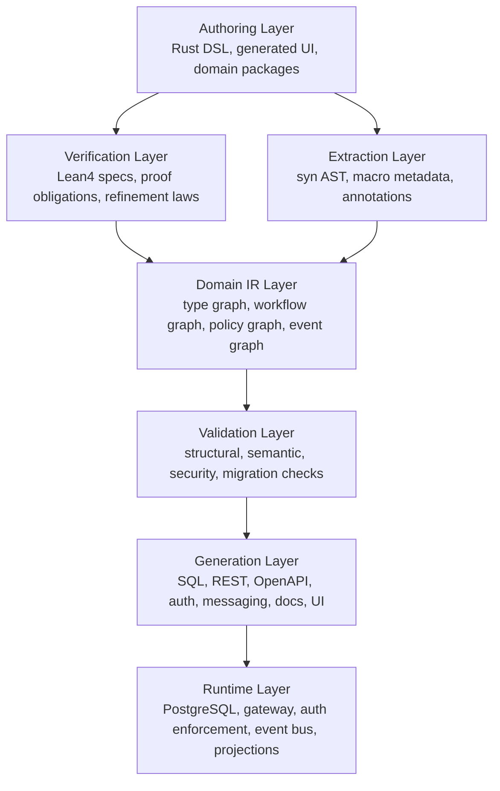
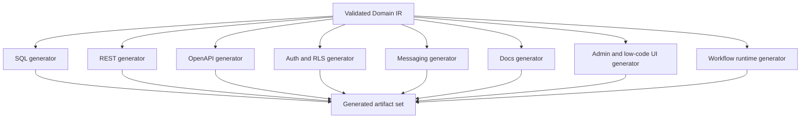
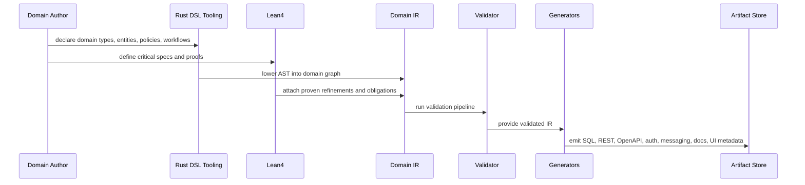
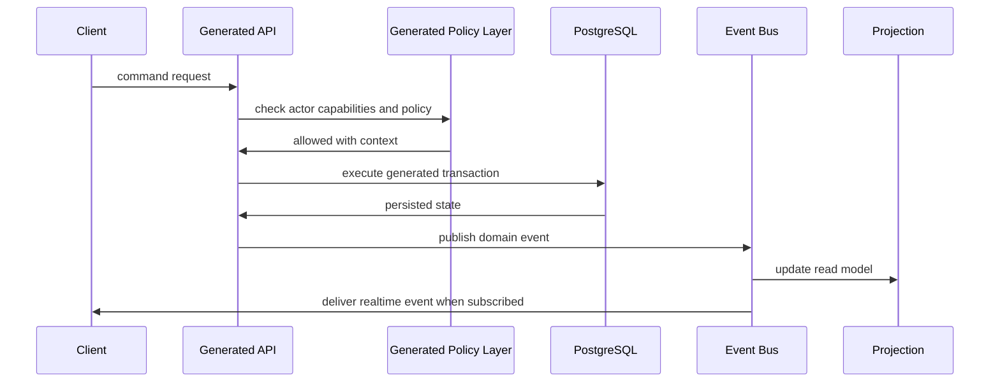

# Architecture Overview

This document gives the system-level view of the redesigned EvoBase. It should
be read after [00_vision.md](00_vision.md) and before the more focused documents
on the domain language, verification, IR, workflows, auth, messaging, and
generators.

## Current And Target Shape

Current EvoBase is database-led:

Target EvoBase is domain-led:

The old architecture begins from storage and exposes it. The new architecture
begins from meaning and derives storage.

## Layered Architecture

The runtime remains important, but it is no longer the place where domain truth
is authored. Runtime components enforce generated contracts.

## Core Components

### Domain Package

A domain package is the unit of authoring and generation. It contains:

- Rust DSL declarations.
- Optional Lean4 specifications.
- Domain documentation.
- Migration intent metadata.
- Generator configuration.
- Compatibility and versioning metadata.

The package is closer to a product model than a code module. It is the artifact
reviewed by engineers, product owners, auditors, and generator tools.

### Rust DSL Frontend

The Rust DSL is the primary human-authored syntax. It uses Rust itself rather
than YAML, JSON, Prisma schema, Ent schema, or a custom DSL. The DSL is parsed
with `syn`, enriched by procedural macros, and lowered into the Domain IR.

See [02_domain_language.md](02_domain_language.md).

### Lean4 Specification Layer

Lean4 is used as a specification and proof environment. It is not part of the
production runtime request path. Lean4 defines invariants, state-machine laws,
authorization theorems, refinement laws, and migration compatibility proofs
where the cost is justified.

See [04_lean4_verification.md](04_lean4_verification.md).

### Domain IR

The Domain IR is the central abstraction. It must be stable enough for
generators and validators, but expressive enough to preserve domain intent.

It contains:

- Metadata model.
- Type graph.
- Entity and aggregate graph.
- Workflow graph.
- Policy graph.
- Event graph.
- Projection and read-model graph.
- Generator capability metadata.

See [05_domain_ir.md](05_domain_ir.md).

### Validation Pipeline

The validation pipeline checks the IR before generation. Validation is split
into phases:

1. Syntax validity from Rust parsing.
2. Local declaration validity from macros.
3. Type graph validity.
4. Aggregate and relationship validity.
5. Workflow totality and transition validity.
6. Policy coverage and denial safety.
7. Event contract consistency.
8. Persistence compatibility.
9. Migration compatibility.
10. Generator readiness.

Validation returns structured diagnostics tied back to source declarations.

### Generator Pipeline

Generators consume the validated Domain IR. They do not parse the Rust DSL
directly and they do not invent semantics.

Generator boundaries are detailed in
[09_generator_architecture.md](09_generator_architecture.md).

## Control Flow

### Build-Time Flow

### Runtime Flow

Runtime behavior is generated from domain declarations:

Runtime is still responsible for validation of external input, database
transactionality, event publication, and enforcement. But those behaviors are
generated from the IR.

## Data Ownership

The redesigned architecture separates several kinds of state:

- Domain state: business records stored in PostgreSQL.
- Workflow state: entity state markers and transition history.
- Auth state: actors, credentials, capability grants, policy context.
- Event state: domain event log or outbox.
- Projection state: generated read models and materialized views.
- Metadata state: domain package versions and generated artifact fingerprints.

Not every deployment needs every storage table. The key is that all storage
shape is derived from domain concepts, not hand-authored as the first layer.

## Verification Boundaries

Different guarantees are checked at different places:

| Boundary | Guarantee |
| --- | --- |
| Lean4 | proven invariants, transition laws, refinement laws |
| Rust DSL | declaration typing, macro-level shape, domain package authoring |
| Domain IR | graph consistency and generator contract |
| Generated validators | external input validation |
| PostgreSQL | durable constraints, FK integrity, RLS enforcement |
| Runtime policy layer | capability checks and actor-context decisions |
| Event bus | contract-safe event publication |

This layered model accepts that external data always needs runtime validation
while still pushing as many invalid states as possible out of the representable
domain.

## Key Tradeoffs

### More Upfront Modeling

The redesign asks teams to model domain concepts explicitly. That is heavier
than pointing a gateway at an existing table. The benefit is that workflows,
auth, events, generated UI, and docs all share one semantic model.

### Rust DSL Instead Of Neutral Config

Rust gives type checking, tooling, macros, and syntax parsing. It also means
non-engineer authoring must eventually happen through generated UIs rather than
raw source editing. This is acceptable because the long-term platform is a
domain definition platform. See [10_low_code_platform.md](10_low_code_platform.md).

### Lean4 Where It Matters

Lean4 can create friction if used for everything. EvoBase should use Lean4 for
critical invariants, reusable refinement libraries, workflow laws, and security
properties. Simpler constraints can stay in Rust DSL validation and generated
SQL checks.

### PostgreSQL As First Target

The new model is not database-first, but PostgreSQL remains the first durable
runtime target. The IR should not be reduced to PostgreSQL concepts, because it
must also generate auth, events, docs, and UI. Still, PostgreSQL capabilities
such as domains, constraints, transactions, RLS, views, and materialized views
remain essential enforcement mechanisms.

## Architectural North Star

Every new feature should answer these questions:

1. What domain concept does this represent?
2. Is there a type, refinement, policy, event, or workflow transition for it?
3. Can the invariant be verified in Lean4, checked in the IR, or generated as a
   runtime constraint?
4. Which artifacts should be derived from the IR?
5. How will diagnostics point back to the domain model?

If a feature cannot answer these questions, it probably belongs outside the
core platform or needs more domain modeling work.
