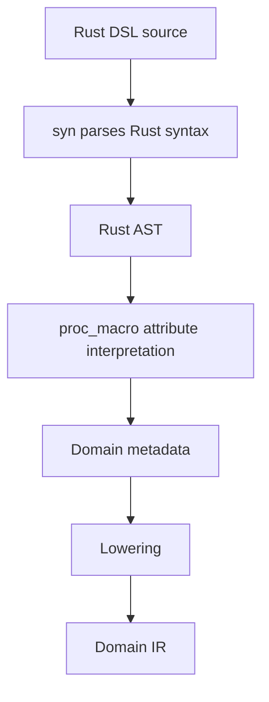
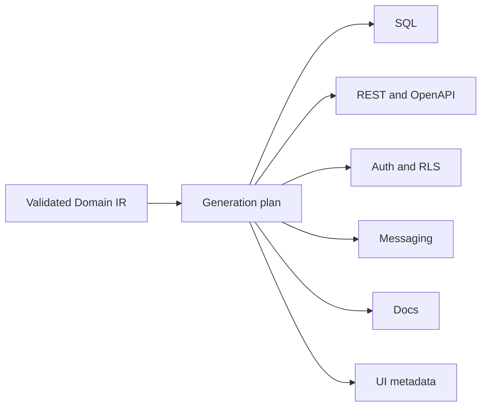

# Domain Language

The EvoBase domain language uses Rust itself as the DSL language. This document
defines the authoring shape, the DDD vocabulary, the parsing flow, and the
tradeoffs compared with YAML, JSON, Prisma schema, Ent schema, and custom text
DSLs.

Related documents:

- [03_refinement_types.md](03_refinement_types.md)
- [05_domain_ir.md](05_domain_ir.md)
- [06_workflow_system.md](06_workflow_system.md)
- [09_generator_architecture.md](09_generator_architecture.md)

## Why Rust As The DSL

Rust is already the natural language of EvoBase. Using Rust as the DSL gives:

- IDE support.
- Syntax highlighting.
- Formatting.
- Namespacing and modules.
- Type checking.
- Procedural macro ecosystem.
- `syn` parsing support.
- `quote`-based generated declarations.
- Cargo package boundaries.
- Existing developer familiarity in the EvoBase codebase.

The DSL is not intended to be ordinary application code. It is a declarative
authoring layer embedded in Rust syntax.

## Why Not YAML

YAML is approachable for configuration, but poor as a domain modeling language:

- Weak typing.
- Ambiguous parsing edge cases.
- Poor refactoring support.
- No native module system.
- No compiler help for renames.
- Easy to duplicate concepts without shared abstractions.
- Hard to represent typed workflow transitions without conventions.

YAML can still be generated as metadata for tooling, but it should not be the
source of truth.

## Why Not JSON

JSON is excellent for interchange and generated artifacts. It is poor for human
domain authoring:

- No comments in standard JSON.
- Verbose syntax.
- No native references beyond string conventions.
- No static checking.
- Difficult to express reusable domain abstractions.

The Domain IR may be serialized as JSON for tool exchange, but JSON should be a
transport format, not the main DSL.

## Why Not Prisma Schema

Prisma schema is focused on database models and client generation. It is
valuable, but narrower than the EvoBase target:

- Entities tend to collapse into persistence models.
- Workflows, policies, events, projections, and verification are not first-class.
- Refinements require conventions or validators outside the schema.
- Category and FP inspired generator interpretations would need a second layer.

EvoBase can learn from Prisma's developer experience while keeping domain
concepts above database modeling.

## Why Not Ent Schema

Ent is powerful for graph-like data modeling and code generation, but EvoBase
needs a broader platform language:

- Ent primarily models entity graphs and persistence.
- EvoBase must model commands, queries, workflows, policies, events,
  projections, read models, and low-code UI metadata.
- Lean4 verification should feed the same model, not be bolted beside an ORM.

Ent-like relationship clarity is valuable, but the EvoBase IR must be more
domain-semantic.

## Why Not A Custom Text DSL

A custom DSL gives perfect syntax control, but it creates a new language to
build, teach, parse, format, version, and integrate with editors. Rust gives
EvoBase a robust host language immediately. Custom syntax may become useful for
non-engineer visual editors later, but those editors should generate or update
domain packages rather than become a separate source of truth.

## Authoring Model

The DSL should represent:

- Entity.
- Value Object.
- Aggregate.
- Domain Event.
- Policy.
- Workflow.
- Projection.
- Read Model.
- Command.
- Query.

Illustrative domain declarations might look like this:

```rust
#[domain]
mod commerce {
    #[value_object]
    struct Email(Refined<String, EmailFormat>);

    #[entity]
    struct User {
        id: UserId,
        email: Email,
        status: UserStatus,
    }

    #[aggregate(root = Order)]
    struct OrderAggregate;

    #[entity]
    struct Order<Draft> {
        id: OrderId,
        buyer: VerifiedUserId,
        total: Money<Usd>,
    }

    #[command]
    struct PayOrder {
        order_id: OrderId,
        payment_id: PaymentId,
    }

    #[event]
    struct OrderPaid {
        order_id: OrderId,
        paid_by: VerifiedUserId,
        amount: Money<Usd>,
    }
}
```

This is not proposed runtime code. It is an example of the shape the DSL should
make possible.

## DDD Concepts

### Entity

An entity has identity across time. Its fields may change, but the identity
remains stable.

Example:

- `User`.
- `Order`.
- `Invoice`.
- `Workspace`.

The DSL should capture:

- Identity type.
- Fields.
- Refinements.
- Relationships.
- Lifecycle state.
- Ownership and tenancy metadata.
- Persistence hints.
- Event emission rules.

Generated artifacts:

- PostgreSQL table.
- primary key and foreign keys.
- REST resource or command endpoints.
- OpenAPI schema.
- UI form metadata.
- documentation.

### Value Object

A value object is defined by its value, not identity. It should be immutable in
concept and comparable by structure.

Examples:

- `Email`.
- `Money`.
- `Address`.
- `DateRange`.
- `PasswordHash`.

Value objects often carry refinements. See
[03_refinement_types.md](03_refinement_types.md).

Generated artifacts:

- Rust refined type wrappers.
- SQL domains or check constraints.
- OpenAPI scalar schemas.
- UI input validators.
- documentation for validation rules.

### Aggregate

An aggregate is a consistency boundary. It groups entities and value objects
that must be changed together under invariant-preserving commands.

Example:

- `OrderAggregate` contains an `Order`, line items, payment references, and
  shipment state.

The aggregate root is the only object external commands directly target.

The DSL should capture:

- Aggregate root.
- Internal entities.
- Invariants.
- Commands accepted by the aggregate.
- Events emitted by successful commands.
- Transaction boundary.

Generated artifacts:

- transactional persistence plan.
- command endpoints.
- event publication outbox rules.
- workflow transition enforcement.

### Domain Event

A domain event is a fact that happened in the domain.

Examples:

- `UserRegistered`.
- `EmailVerified`.
- `OrderPaid`.
- `OrderShipped`.

Events are not generic notifications. They are part of the domain model and
must have typed payloads.

Generated artifacts:

- event contracts.
- outbox table shape.
- SSE stream schemas.
- projection subscriptions.
- future Kafka topic contracts.

See [08_messaging_model.md](08_messaging_model.md).

### Policy

A policy describes when an actor may perform an action on a resource. Policies
can reference roles, capabilities, resource ownership, workflow state, tenant
state, and environmental facts.

Examples:

- A buyer may pay their own draft order.
- A warehouse actor with `ship_order` capability may ship paid orders.
- A support actor may read orders in assigned workspaces.

Policies generate both application checks and database RLS where appropriate.
See [07_auth_model.md](07_auth_model.md).

### Workflow

A workflow is a state machine over domain state. It defines legal states,
commands, transitions, guards, emitted events, and generated endpoints.

Example:

```text
DraftOrder --pay--> PaidOrder --ship--> ShippedOrder
DraftOrder --cancel--> CancelledOrder
PaidOrder --cancel--> CancelledOrder
```

Workflows are first-class because many business rules are transition rules, not
field validations. See [06_workflow_system.md](06_workflow_system.md).

### Projection

A projection consumes domain events and updates a read model. It is optimized
for query and UI needs, not necessarily for aggregate consistency.

Examples:

- `OrderSummaryProjection`.
- `CustomerTimelineProjection`.
- `InventoryAvailabilityProjection`.

Generated artifacts:

- projection handlers.
- read-model storage.
- rebuild plans.
- stream subscriptions.

### Read Model

A read model is a query-optimized shape derived from domain state or events. It
can be a SQL view, materialized view, table, cached document, or generated API
response shape.

Read models are not the source of truth. They are interpretations of events or
aggregate state.

### Command

A command is an intention to change domain state.

Examples:

- `RegisterUser`.
- `VerifyEmail`.
- `PayOrder`.
- `ShipOrder`.

Commands are validated, authorized, executed against an aggregate or workflow,
and normally emit events.

Generated artifacts:

- endpoint route.
- request schema.
- policy hook.
- transaction plan.
- success and error contracts.

### Query

A query asks for information without changing domain state. Queries target read
models or projections rather than raw tables when possible.

Generated artifacts:

- REST read endpoint.
- OpenAPI response schema.
- RLS-safe SQL view or query plan.
- UI list/detail metadata.

## DSL Structure

The domain language should be structured around Rust modules:

```text
domain package
|-- module
|   |-- value objects
|   |-- entities
|   |-- aggregates
|   |-- workflows
|   |-- events
|   |-- policies
|   |-- projections
|   |-- queries
```

Rust module paths become stable domain namespaces. Public names become domain
identifiers. Attributes declare domain roles.

## AST Extraction

The extraction flow is:



Responsibilities:

- `syn`: parse Rust syntax into an AST.
- procedural macros: identify annotated domain declarations and local metadata.
- `quote`: generate compiler-facing helper declarations and diagnostics where
  needed.
- lowering: translate annotated Rust shapes into Domain IR nodes.

The macro layer should be thin. It should avoid embedding generator logic. The
goal of macros is to extract domain declarations and provide authoring feedback,
not to produce every runtime artifact.

## Domain IR Lowering

Lowering maps syntax to semantic nodes:

| Rust DSL | Domain IR |
| --- | --- |
| annotated struct | entity, value object, event, command, read model |
| enum | algebraic state, union, policy result, event variant |
| type parameter | typestate, generic refinement, phantom state |
| attribute argument | metadata node |
| module path | namespace |
| field type | type graph edge |
| trait-like declaration | behavior contract or policy interface |

See [05_domain_ir.md](05_domain_ir.md).

## Validation Pipeline

Validation should be explicit and phased:

1. Parse Rust syntax.
2. Extract DSL annotations.
3. Resolve names.
4. Build the type graph.
5. Check refinement availability.
6. Check entity identity rules.
7. Check aggregate boundaries.
8. Check workflow transitions.
9. Check command/event consistency.
10. Check policy coverage.
11. Check projection subscriptions.
12. Check generator compatibility.

Validation failures should be reported as domain diagnostics:

- missing invariant.
- ambiguous policy.
- illegal transition.
- unbound event.
- unsafe query exposure.
- unrepresentable SQL target.
- unsupported generator target.

## Generation Pipeline

Generation starts only after the IR is valid.



The generation plan records which IR nodes affect which artifacts. This enables
diffs, explainability, and migration planning.

## DSL Design Rules

- Prefer domain names over database names.
- Prefer commands over raw mutations when behavior matters.
- Prefer value objects over primitive strings and numbers.
- Prefer workflow states over nullable status fields.
- Prefer capability policies over role-only checks.
- Prefer events with precise payloads over generic message blobs.
- Prefer generated read models over exposing aggregate internals.

## Example Domain Slice

```rust
#[workflow(entity = Order)]
enum OrderLifecycle {
    Draft,
    Paid,
    Shipped,
    Cancelled,
}

#[transition(from = Draft, to = Paid, command = PayOrder, event = OrderPaid)]
fn pay(actor: VerifiedUserId, order: DraftOrder, payment: PaymentId) -> PaidOrder;

#[policy(command = PayOrder)]
fn buyer_can_pay(actor: Actor, order: DraftOrder) -> Decision;
```

This small slice would lower into:

- workflow graph states: `Draft`, `Paid`, `Shipped`, `Cancelled`.
- transition edge: `pay`.
- command contract: `PayOrder`.
- event contract: `OrderPaid`.
- policy node: `buyer_can_pay`.
- generated endpoint: `POST /orders/{id}/pay`.
- generated SQL constraints: valid state values and transition checks.
- generated RLS or policy hook: buyer capability check.

## Compatibility With Generated UI

Business analysts should not be required to write Rust. The long-term low-code
UI should edit a structured domain model and emit the same domain package shape
or directly update the IR through a governed path. Rust remains the canonical
human-reviewable form for engineers.

See [10_low_code_platform.md](10_low_code_platform.md).
