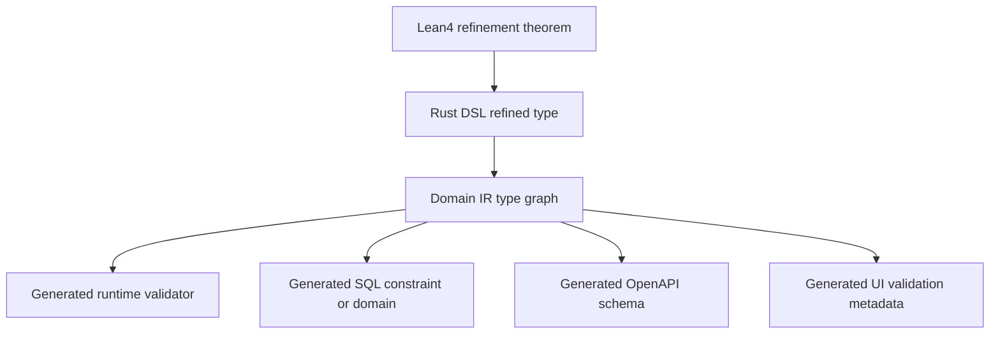
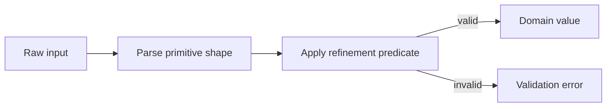
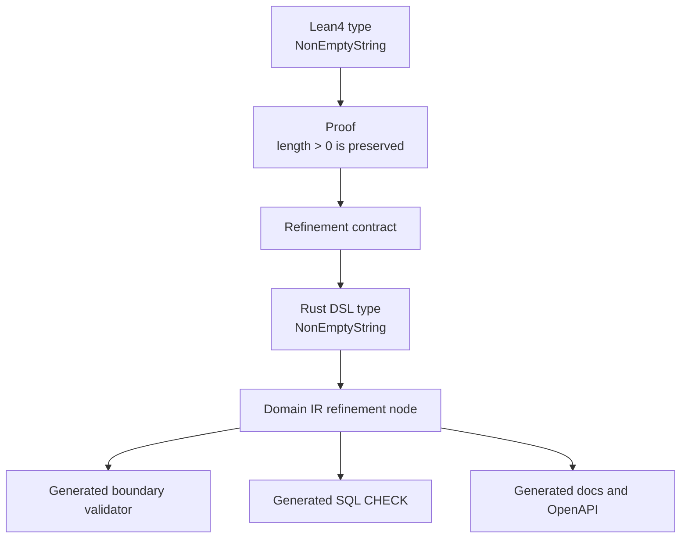

# Refinement Types

Refinement types are one of the main tools for making illegal states
unrepresentable. A refinement type is a normal type plus a predicate that must
hold for values of that type.

Examples:

- `Email`: string matching an email format predicate.
- `NonEmptyString`: string with length greater than zero.
- `PasswordHash`: string produced by an approved password hashing scheme.
- `PositiveInt`: integer greater than zero.
- `Money`: amount with currency and scale invariants.
- `UserId`: stable identity for any user.
- `VerifiedUserId`: user identity with verified status evidence.
- `DraftOrder`, `PaidOrder`, `ShippedOrder`: workflow-state-refined orders.

Related documents:

- [04_lean4_verification.md](04_lean4_verification.md)
- [06_workflow_system.md](06_workflow_system.md)
- [07_auth_model.md](07_auth_model.md)
- [09_generator_architecture.md](09_generator_architecture.md)

## Concept

In ordinary modeling, a type such as `String` can represent valid and invalid
business values:

```text
String = "", "alice@example.com", "not an email", "   "
```

A refined type narrows that set:

```text
Email = { value: String | is_valid_email(value) }
```

The refinement predicate becomes part of the domain model. It should flow into
Lean4 specs, Rust DSL declarations, runtime validators, PostgreSQL constraints,
OpenAPI schemas, UI form metadata, and documentation.

## Guarantee Layers



Compile-time guarantees and runtime guarantees cooperate:

- Compile time prevents domain authors from wiring incompatible types.
- Runtime validation protects boundaries where untrusted data enters.
- PostgreSQL constraints protect durable storage.
- OpenAPI and UI metadata help clients avoid invalid input early.

## Compile-Time Guarantees

Rust can prevent accidental type confusion:

- `Email` is not interchangeable with arbitrary `String`.
- `UserId` is not interchangeable with `OrderId`.
- `VerifiedUserId` is not interchangeable with unverified `UserId`.
- `Order<Paid>` is not interchangeable with `Order<Draft>`.

This catches many errors before the system runs. For example, a `ship` command
can require a `PaidOrder`, making it impossible to call with a `DraftOrder`
inside generated domain-safe code.

## Runtime Validation Fallback

All external input is untrusted:

- HTTP request bodies.
- Query parameters.
- JWT claims.
- imported CSV/JSON data.
- messages from external brokers.
- admin UI edits.
- low-code UI edits.

Therefore every refined type also needs a generated parser or validator at the
boundary. If input cannot be refined, it is rejected with a typed diagnostic.



## Generated SQL Constraints

Refinements should lower into PostgreSQL when possible:

| Refinement | Possible PostgreSQL Artifact |
| --- | --- |
| `NonEmptyString` | `CHECK (length(trim(value)) > 0)` |
| `PositiveInt` | `CHECK (value > 0)` |
| `Money<Usd>` | numeric scale and currency constraints |
| `Email` | domain or check constraint with conservative validation |
| `UserId` | UUID type, PK/FK constraints |
| `VerifiedUserId` | FK to users plus status predicate through policy or generated check |
| workflow state | enum/domain plus transition rules |

Some refinements cannot be perfectly represented in SQL. Those must still be
documented in the IR as partially enforced at the database layer and fully
enforced by generated validators or policies.

## Flow From Lean4 To Rust To PostgreSQL



Lean4 proves reusable laws such as:

- constructing a `NonEmptyString` from a valid input preserves non-emptiness.
- concatenating two `NonEmptyString` values is non-empty.
- a successful email verification transition yields `VerifiedUserId`.
- `Money` addition preserves currency and scale.

The generated artifacts then enforce or reflect those laws in practical runtime
targets.

## Refinement Catalog

### Email

Purpose:

- distinguish user email addresses from arbitrary text.
- generate API and UI validation.
- support uniqueness constraints.

Important decisions:

- Email validation should be conservative. Perfect email validation is
  surprisingly complex.
- Canonicalization rules should be explicit, especially case handling.
- Uniqueness should be over the canonical representation, not raw input.

Generated artifacts:

- boundary parser.
- SQL domain or check constraint.
- unique index on canonical email.
- OpenAPI format and docs.
- UI email input metadata.

### NonEmptyString

Purpose:

- prevent empty display names, titles, labels, and required text fields.

Generated artifacts:

- boundary parser rejecting empty or whitespace-only strings depending on
  policy.
- SQL check constraint.
- UI required field rule.

### PasswordHash

Purpose:

- prevent raw passwords from being stored where a hash is expected.

Important decisions:

- `PasswordHash` should represent a hash produced by an approved algorithm, not
  simply a string that happens to be non-empty.
- Password raw input and password hash should be distinct types.

Generated artifacts:

- storage column with algorithm metadata.
- docs that mark it as write-protected or internal.
- API schemas that never expose the hash.

### PositiveInt

Purpose:

- quantities, limits, counts, and retry attempts that cannot be negative or
  zero.

Generated artifacts:

- SQL `CHECK (value > 0)`.
- UI numeric input lower bound.
- OpenAPI minimum.

### Money

Purpose:

- represent amounts without floating point ambiguity.
- carry currency and scale.

Important decisions:

- Money should not be stored as floating point.
- Currency conversions should be explicit domain operations.
- `Money<Usd>` and `Money<Vnd>` should not be addable without conversion.

Generated artifacts:

- numeric column with scale.
- currency constraint.
- generated docs for rounding rules.
- UI currency formatting metadata.

### UserId And VerifiedUserId

Purpose:

- distinguish identity from verification status.

`UserId` says a user exists. `VerifiedUserId` says a user exists and carries
evidence that the verification workflow has completed.

Generated artifacts:

- FK constraints for user existence.
- policy checks for verification status.
- workflow transition from unverified to verified.
- command signatures requiring verified actors where needed.

### Workflow State Refinements

Workflow states can be modeled as refined entity types:

```text
Order<Draft>
Order<Paid>
Order<Shipped>
```

or as named aliases:

```text
DraftOrder = Order<Draft>
PaidOrder = Order<Paid>
ShippedOrder = Order<Shipped>
```

The important property is that transitions consume one state and produce
another.

```text
pay: DraftOrder -> PaidOrder
ship: PaidOrder -> ShippedOrder
cancel: DraftOrder | PaidOrder -> CancelledOrder
```

See [06_workflow_system.md](06_workflow_system.md).

## Refinement Metadata

The Domain IR should store:

- refinement name.
- base type.
- predicate identity.
- error code.
- human-readable rule.
- Lean4 specification link if present.
- Rust validator identity.
- SQL constraint strategy.
- OpenAPI schema strategy.
- UI validation strategy.
- enforcement level per target.

Enforcement levels:

- proven.
- statically checked.
- runtime validated.
- database enforced.
- documented only.
- unsupported by target.

This prevents pretending that every target enforces every rule equally.

## Refinement Composition

Refinements should compose:

```text
RequiredEmail = NonEmptyString & EmailFormat
PositiveQuantity = PositiveInt & MaxValue<1000>
VerifiedBuyerId = UserId & UserExists & EmailVerified & BuyerRole
```

Composition is a practical use of product-like structure: a value satisfies the
combined refinement if it satisfies each component. The validation result should
accumulate errors where possible instead of failing at the first issue. See
[12_functional_programming_mapping.md](12_functional_programming_mapping.md).

## Failure Semantics

Every refinement should define:

- error code.
- user-facing message.
- developer-facing message.
- severity.
- boundary behavior.
- whether the invalid value can be safely logged.

Examples:

| Refinement | Error Code |
| --- | --- |
| `Email` | `invalid_email` |
| `NonEmptyString` | `empty_string` |
| `PositiveInt` | `not_positive` |
| `Money` | `invalid_money_amount` |
| `VerifiedUserId` | `user_not_verified` |

## Tradeoffs

### Stronger Types Add Friction

Refinements require explicit construction and validation. This is friction, but
it is purposeful. The most dangerous errors should be impossible to express
accidentally.

### Not All Rules Are Static

Some rules depend on database state, time, actor context, or external systems.
These cannot be fully compile-time refinements. EvoBase should still model them
as refinements or policies with clear enforcement boundaries.

### SQL Constraints Are Not Enough

PostgreSQL constraints are excellent final guards, but they are too late for
good developer experience and cannot express all domain semantics. Refinements
must be visible earlier in the pipeline.

## Design Rule

Primitive obsession is a platform smell. If a string, integer, UUID, or decimal
has business meaning, it deserves a domain type or refinement.
