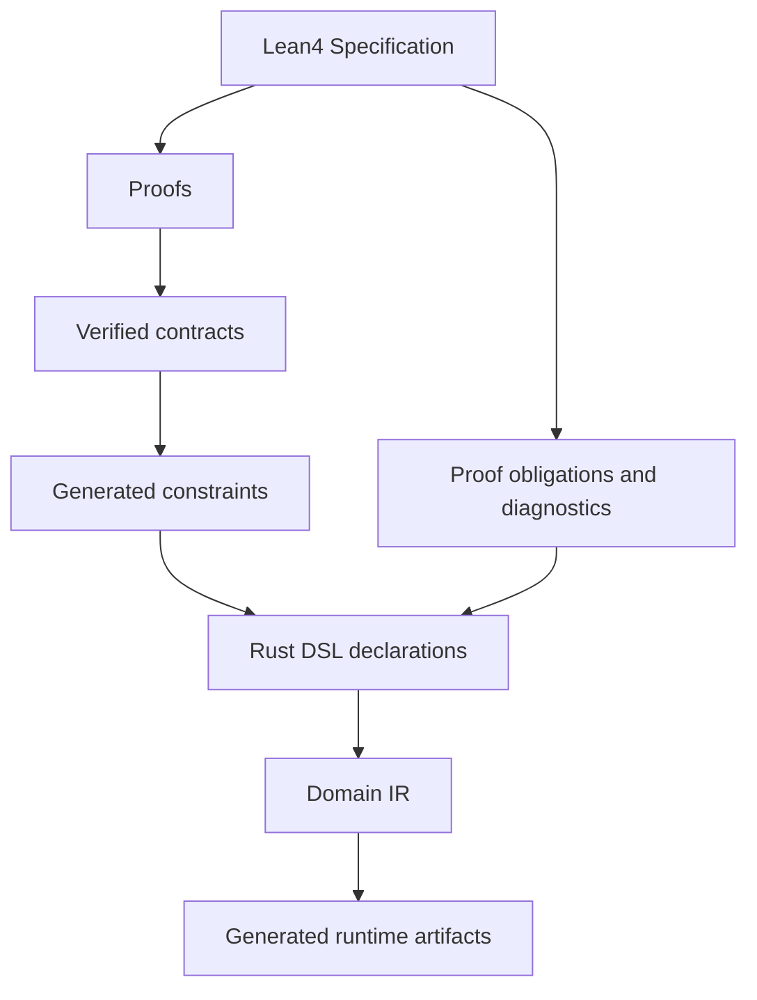
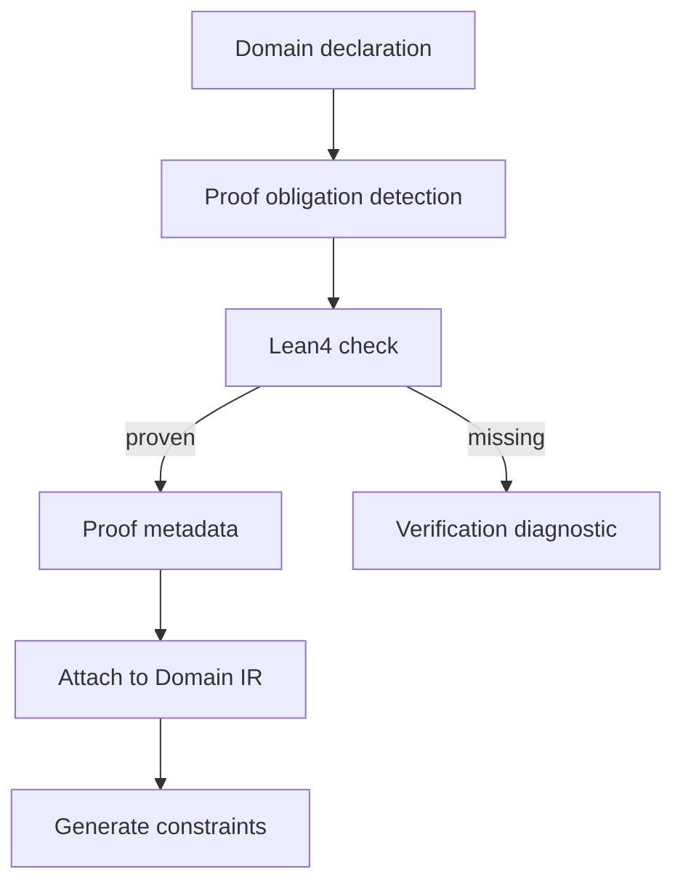

# Lean4 Verification

Lean4 is the verification layer for EvoBase. It is not the runtime. It is the
specification environment where critical invariants can be stated, checked, and
used to guide generated constraints.

The verification-first pipeline is:

```text
Lean4 specification -> Proofs -> Generated constraints -> Rust DSL -> Runtime
```

Related documents:

- [03_refinement_types.md](03_refinement_types.md)
- [05_domain_ir.md](05_domain_ir.md)
- [06_workflow_system.md](06_workflow_system.md)
- [11_category_theory_mapping.md](11_category_theory_mapping.md)
- [12_functional_programming_mapping.md](12_functional_programming_mapping.md)

## Role Of Lean4

Lean4 should be used to specify and prove:

- refinement predicates and preservation laws.
- workflow transition safety.
- aggregate invariants.
- authorization safety properties.
- event contract relationships.
- migration compatibility properties where feasible.
- generator laws for critical transformations.

Lean4 should not be used for:

- handling HTTP requests.
- replacing PostgreSQL constraints.
- writing runtime business logic.
- proving every small formatting or UI rule.

The rule of thumb is: use Lean4 when being wrong would cause a security issue,
money issue, data corruption issue, or deep workflow inconsistency.

## Architecture



The generated constraints are not necessarily emitted directly from Lean4 into
SQL. More commonly, Lean4 proves a contract, the Domain IR records that
contract, and generators decide how to enforce it in each target.

## Curry-Howard

Curry-Howard is the correspondence between propositions and types, and between
proofs and programs.

Practical EvoBase mapping:

| Curry-Howard Concept | EvoBase Meaning |
| --- | --- |
| proposition | domain invariant |
| proof | evidence the invariant holds |
| type | specification of valid values |
| program | construction or transition that preserves validity |

Example:

```text
Proposition: an order can be shipped only if it is paid.
Type: ship accepts PaidOrder, not DraftOrder.
Proof: every path to ShippedOrder passes through PaidOrder.
Generated result: no ship endpoint accepts draft state.
```

Curry-Howard matters because it turns rules into artifacts that tools can
check, not just comments that developers must remember.

## Dependent Types

Dependent types allow types to depend on values. They are useful for expressing
precise invariants:

- a list with length greater than zero.
- money with a specific currency.
- an order indexed by workflow state.
- a user identity indexed by verification evidence.

Illustrative Lean-style example:

```lean
structure NonEmptyString where
  value : String
  proof : value.length > 0
```

This says a `NonEmptyString` is not just a string. It includes evidence that the
string is non-empty.

EvoBase does not need to expose dependent types to every domain author. It can
use Lean4 internally to define reusable verified concepts and expose them in
the Rust DSL as refinements.

## Refinement Types

Refinement types are the practical bridge between Lean4 and generated runtime
artifacts.

```text
Base type + predicate = refined domain type
```

Examples:

- `String + is_email = Email`
- `Int + greater_than_zero = PositiveInt`
- `Order + state_is_paid = PaidOrder`

Lean4 can prove laws about those predicates. Rust can expose domain-safe types.
PostgreSQL can enforce what it can through constraints. Runtime validators
guard the boundary.

See [03_refinement_types.md](03_refinement_types.md).

## Proof-Carrying Design

Proof-carrying design means declarations carry evidence or references to
evidence for important guarantees.

In EvoBase, this can appear as:

- a refinement type linked to a Lean theorem.
- a workflow transition linked to a proof of state preservation.
- a policy linked to a proof that denied states cannot reach protected
  commands.
- a migration linked to a proof or check that old valid data remains valid.

The Domain IR should record proof metadata:

- proof identifier.
- theorem name.
- specification module.
- trusted status.
- proof obligation status.
- affected domain nodes.
- target constraints generated from the proof.

Not every declaration needs a formal proof. But the IR should distinguish
between proven guarantees and convention-based checks.

## Verification Targets

### Refinement Laws

Examples:

- `NonEmptyString.trimmed` remains non-empty only when trimming does not remove
  all characters. If this cannot be proven generally, the API must return an
  optional or validation result.
- `Money.add` preserves currency when both operands have the same currency.
- `Email.canonicalize` preserves email validity.

### Workflow Laws

Examples:

- `ShippedOrder` is reachable only from `PaidOrder`.
- `CancelledOrder` has no outgoing transition except explicitly modeled
  administrative recovery.
- Every transition emits exactly the declared event.
- A transition cannot skip required guards.

### Authorization Laws

Examples:

- No actor without `ship_order` capability can execute `ShipOrder`.
- Ownership checks are required for buyer-only commands.
- Admin capabilities do not implicitly bypass tenant isolation unless declared.

### Event Laws

Examples:

- `OrderPaid` is emitted only by the `pay` transition.
- Projection input schemas match event payload schemas.
- Event version upgrades are backward compatible.

### Migration Laws

Examples:

- adding a nullable field preserves old records.
- adding a required refined field requires a backfill proof or migration plan.
- splitting a state requires a total mapping from old states to new states.

## Verification Pipeline



The pipeline should be able to run in tiers:

- basic: parse, validate, generate without formal proofs for non-critical
  domains.
- checked: require proof obligations for selected refinements and workflows.
- strict: require proofs for all declarations marked critical.

## Generated Constraints

Lean4 proofs do not replace runtime enforcement. They guide it.

Examples:

| Proven Concept | Generated Constraint |
| --- | --- |
| `PositiveInt` predicate | SQL check, API minimum, UI lower bound |
| workflow transition graph | transition endpoints and state constraints |
| required authorization guard | generated policy hook and RLS predicate |
| event payload compatibility | event schema and projection input contract |
| migration compatibility | generated migration pre-check |

## Trust Boundary

Lean4 verifies the specification. A generator bug can still produce wrong SQL
from a correct spec. Therefore critical generators should also have laws and
tests:

- IR preservation: generated artifact represents the intended IR node.
- no silent dropping: every critical invariant appears in at least one
  enforcement target.
- explainability: generated artifact links back to source and proof metadata.

For the most important generators, EvoBase can use Lean4 to specify generator
properties at an abstract level, even if the generator itself is written in
Rust.

## Example: Paid Before Shipped

Informal specification:

```text
For all orders, if an order is in Shipped state, then it must previously have
passed through Paid state.
```

Domain effect:

- `ship` consumes `PaidOrder`.
- no transition from `DraftOrder` to `ShippedOrder`.
- generated endpoint is `POST /orders/{id}/ship`.
- endpoint validates the current stored state is `Paid`.
- event stream can derive `OrderShipped` only from `ship`.

Lean4 can prove the graph reachability property for the workflow definition.

## Example: Verified User

Informal specification:

```text
Only a user that completed email verification can become VerifiedUserId.
```

Domain effect:

- commands requiring verified identity accept `VerifiedUserId`.
- JWT claims alone do not manufacture `VerifiedUserId` unless backed by
  verification status.
- generated policy checks ensure verification status still holds.
- database constraints or RLS prevent unsafe use where possible.

## Diagnostics

Verification diagnostics should be domain-level, not theorem-prover dumps. They
should say:

- which domain declaration created the obligation.
- which invariant is unproven.
- which generated artifacts are blocked.
- whether the author can downgrade the requirement.
- which reference theorem or helper may be used.

Example:

```text
Workflow OrderLifecycle:
  transition ship requires proof that Shipped is reachable only from Paid.
  No proof attached.
  Blocks generation of ship endpoint in strict mode.
```

## Practical Adoption Strategy

1. Start with a small library of verified refinements:
   `NonEmptyString`, `PositiveInt`, `Money`, identity types.
2. Add workflow graph proofs for typestate transitions.
3. Add authorization proof obligations for high-risk policies.
4. Add event compatibility checks.
5. Add migration compatibility checks for critical domains.

This keeps Lean4 useful without making every product change dependent on formal
methods expertise.
