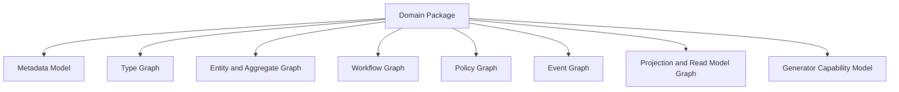
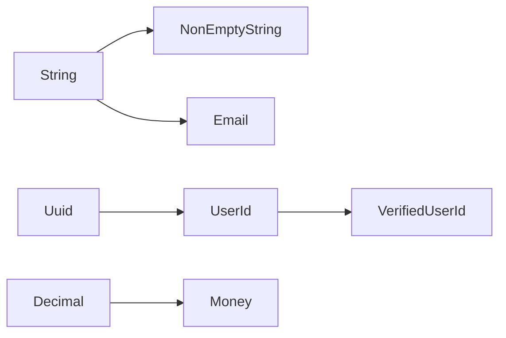
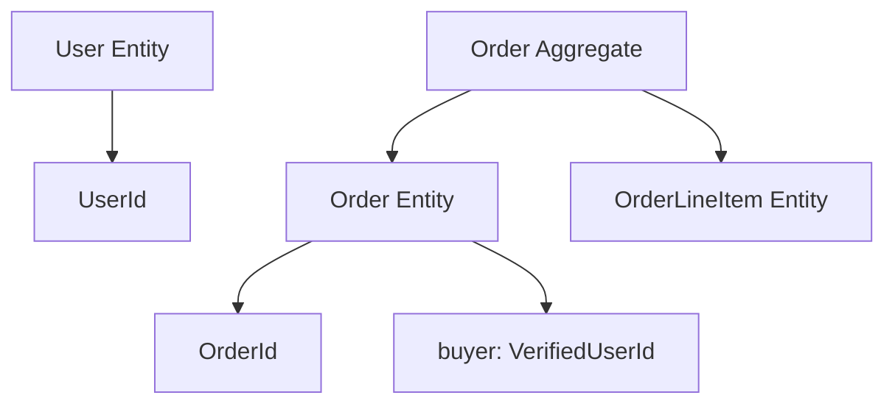
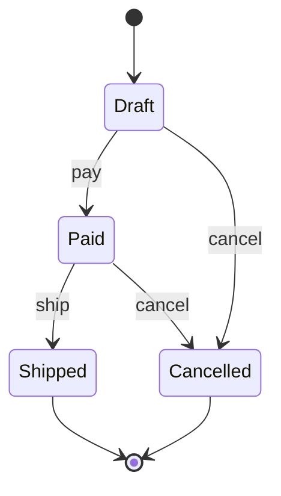
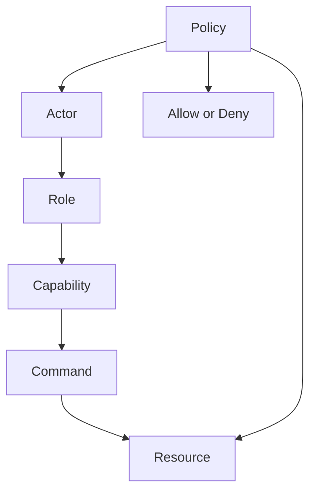
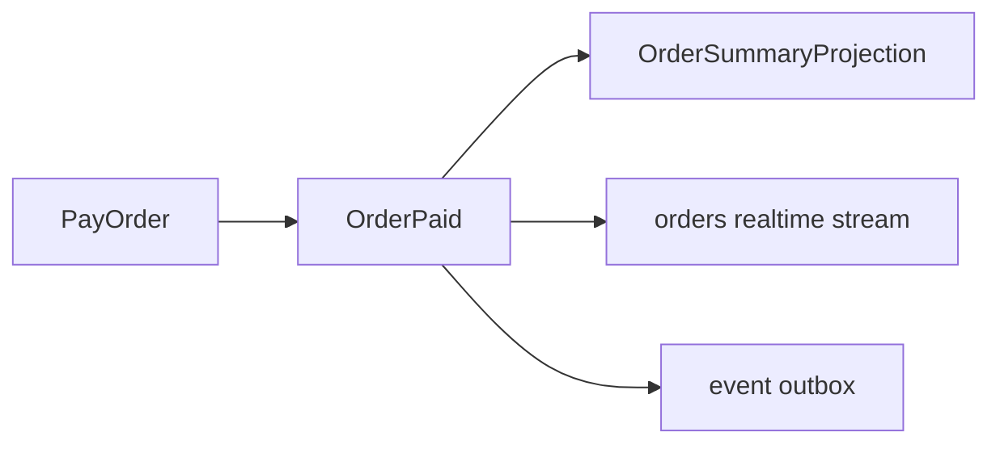

# Domain IR

The Domain IR is the central abstraction in the redesigned EvoBase.

```text
Rust DSL -> AST -> Domain IR -> Generators
```

Generators must consume the IR, not Rust syntax. Validators must reason over
the IR, not generated SQL. Documentation, UI, policies, events, and migrations
must all point back to IR nodes.

Related documents:

- [02_domain_language.md](02_domain_language.md)
- [03_refinement_types.md](03_refinement_types.md)
- [04_lean4_verification.md](04_lean4_verification.md)
- [09_generator_architecture.md](09_generator_architecture.md)

## Purpose

The IR exists to:

- preserve domain meaning after Rust syntax is parsed.
- provide a stable contract for generators.
- support validation across domain graphs.
- attach proof metadata and enforcement levels.
- make generated artifacts explainable.
- enable low-code tools to edit domain definitions safely.

The IR is not a database schema representation. It contains enough persistence
metadata to generate a database schema, but it also contains workflows,
policies, events, projections, commands, queries, refinements, and UI metadata.

## High-Level Shape



Each graph is separate but linked by stable IDs.

## Stable Identity

Every IR node should have:

- stable domain ID.
- namespace.
- display name.
- source location.
- version metadata.
- documentation metadata.
- generator visibility.
- proof metadata if applicable.

Stable IDs matter because generated migrations, docs, policy diffs, and UI
layouts need to survive renames when the author explicitly records them.

## Metadata Model

The metadata model stores package-level and node-level information:

- package name.
- package version.
- authorship metadata.
- target generator set.
- compatibility mode.
- domain module hierarchy.
- source file and span.
- deprecation metadata.
- migration intent.
- documentation strings.
- UI hints.
- audit sensitivity.
- privacy classification.

Metadata must be structured. Free-form strings are useful for docs, but
generators need typed metadata.

## Type Graph

The type graph contains:

- primitive types.
- refined types.
- value objects.
- identity types.
- enums and coproducts.
- product types.
- generic types.
- typestate markers.
- collection types.
- optional types.
- external references.



The type graph records:

- base type.
- refinements.
- constructors.
- validation rules.
- serialization shape.
- SQL representation.
- OpenAPI representation.
- UI representation.
- proof links.

## Entity And Aggregate Graph

The entity graph contains identity-bearing domain objects and relationships.
The aggregate graph overlays consistency boundaries.



The graph records:

- entity identity.
- fields and field types.
- required vs optional fields.
- relationships.
- ownership.
- tenant boundaries.
- aggregate root.
- internal aggregate members.
- invariants.
- persistence strategy.
- audit policy.

Important rule: not every entity relationship should become a public API
relationship. Public exposure is a generator decision constrained by policy.

## Workflow Graph

The workflow graph contains:

- workflow name.
- state nodes.
- transition edges.
- command associated with each transition.
- event emitted by each transition.
- guard and policy requirements.
- terminal states.
- compensating transitions.
- timeout or scheduled transitions.



The workflow graph is used by:

- typestate modeling.
- command endpoint generation.
- SQL state constraints.
- policy coverage checks.
- event emission checks.
- UI action availability.

See [06_workflow_system.md](06_workflow_system.md).

## Policy Graph

The policy graph contains:

- actors.
- roles.
- capabilities.
- permissions.
- resources.
- policy rules.
- context requirements.
- denial behavior.
- delegation rules.
- RLS generation metadata.



The graph should avoid RBAC-only modeling. Roles are groups of capabilities.
Capabilities authorize action categories. Policies decide whether a capability
applies to a resource in context.

See [07_auth_model.md](07_auth_model.md).

## Event Graph

The event graph contains:

- domain event definitions.
- payload type.
- source aggregate or workflow.
- causation command.
- version.
- compatibility rules.
- projection subscribers.
- stream exposure rules.
- delivery guarantees.



Events are domain facts. The IR should know which command or transition emits
which event. Ad hoc message publication should not bypass the event graph.

See [08_messaging_model.md](08_messaging_model.md).

## Projection And Read Model Graph

Projection nodes define event consumers. Read model nodes define query shapes.

The graph records:

- source events.
- projection function identity.
- read model schema.
- rebuild strategy.
- ordering and idempotency keys.
- freshness requirements.
- public query exposure.
- RLS or policy strategy.

Generated UI and API should prefer read models for query screens instead of
exposing aggregate internals.

## Command And Query Model

Commands:

- change domain state.
- require authorization.
- validate input.
- execute within an aggregate or workflow boundary.
- emit events.

Queries:

- do not change domain state.
- target read models or projections.
- require authorization.
- define response shape and pagination.

The IR should distinguish commands and queries even if both eventually generate
HTTP endpoints.

## Validation Model

The IR validation pipeline should produce structured diagnostics. Important
validation categories:

- name resolution.
- type compatibility.
- refinement availability.
- missing identity.
- invalid aggregate relationship.
- workflow transition gap.
- unreachable state.
- missing policy for public command.
- event without source command.
- projection subscribed to unknown event.
- unsupported SQL representation.
- unsafe public exposure.
- migration incompatibility.

Diagnostics should be attached to IR node IDs and source spans.

## Enforcement Metadata

Every invariant should have an enforcement matrix:

| Target | Status |
| --- | --- |
| Lean4 | proven, unchecked, not applicable |
| Rust DSL | statically checked, unchecked |
| Runtime validator | generated, custom, unavailable |
| PostgreSQL | constraint, RLS, trigger, unavailable |
| OpenAPI | represented, partially represented, unavailable |
| UI | represented, partially represented, unavailable |

This matrix is critical for honesty. It prevents a generator from implying that
an invariant is enforced where it is only documented.

## Generator Capability Model

Each generator should declare what it supports:

- supported type mappings.
- supported refinements.
- supported workflow features.
- supported policy forms.
- supported event delivery semantics.
- unsupported features and fallback behavior.

The validation pipeline checks the IR against generator capability before
artifact generation.

## Serialization

The IR should have a deterministic serialized form for:

- artifact caching.
- review diffs.
- low-code UI editing.
- generator testing.
- package registry.
- audit logs.

JSON is a good interchange format for serialized IR, even though JSON is not
the authoring DSL.

## IR Versioning

The IR itself must be versioned. Domain package versions and IR schema versions
are different:

- Domain package version: product model version.
- IR schema version: EvoBase toolchain contract version.
- Generator version: artifact interpretation version.

Generated artifacts should record all three.

## Design Rule

If a concept affects more than one generated artifact, it belongs in the IR.
If it appears only in one generator and has no domain meaning, it belongs in
that generator's configuration.
