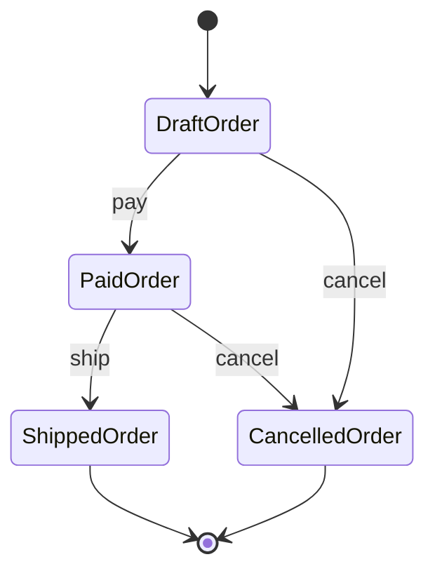
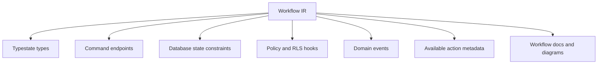

# Workflow System

Workflows are first-class in the redesigned EvoBase. They model business state
machines, not incidental status fields.

Related documents:

- [02_domain_language.md](02_domain_language.md)
- [03_refinement_types.md](03_refinement_types.md)
- [04_lean4_verification.md](04_lean4_verification.md)
- [05_domain_ir.md](05_domain_ir.md)
- [08_messaging_model.md](08_messaging_model.md)

## Why Workflows Are First-Class

Many domain rules are transition rules:

- An order can be paid only while draft.
- An order can be shipped only after payment.
- A cancelled order cannot be shipped.
- A verified user can access capabilities unavailable to unverified users.
- A refund can be requested only after settlement.

CRUD cannot express these rules safely by itself. A generic update endpoint can
attempt to set `status = 'shipped'` from any previous value unless extra logic
is added. EvoBase should make the transition itself the unit of behavior.

## Typestate Pattern

Typestate models state at the type level.

```text
Order<Draft>
Order<Paid>
Order<Shipped>
Order<Cancelled>
```

Transitions consume one typed state and produce another:

```text
pay: Order<Draft> -> Order<Paid>
ship: Order<Paid> -> Order<Shipped>
cancel: Order<Draft> | Order<Paid> -> Order<Cancelled>
```

This makes illegal transitions unrepresentable in generated domain-safe code.
A function that ships an order cannot even accept a draft order.

## Example: Order Lifecycle



Transition table:

| Transition | From | To | Command | Event |
| --- | --- | --- | --- | --- |
| `pay` | `DraftOrder` | `PaidOrder` | `PayOrder` | `OrderPaid` |
| `ship` | `PaidOrder` | `ShippedOrder` | `ShipOrder` | `OrderShipped` |
| `cancel` | `DraftOrder` | `CancelledOrder` | `CancelOrder` | `OrderCancelled` |
| `cancel` | `PaidOrder` | `CancelledOrder` | `CancelOrder` | `OrderCancelled` |

There is no transition from `DraftOrder` to `ShippedOrder`.

## Workflow Definition Contents

A workflow declaration should define:

- workflow name.
- target entity or aggregate.
- states.
- initial state.
- terminal states.
- transitions.
- transition command.
- transition event.
- guards.
- authorization policy.
- idempotency behavior.
- compensation behavior.
- timeout behavior when needed.

## Guards And Policies

Guards are domain predicates that must hold for a transition:

- payment authorized.
- inventory reserved.
- actor is buyer.
- actor has `ship_order` capability.
- order belongs to actor's tenant.

Policies answer authorization. Guards answer domain readiness. The two may
overlap but should remain conceptually distinct.

Example:

```text
ship transition:
  from: PaidOrder
  to: ShippedOrder
  guard: shipment label exists
  policy: actor has ship_order capability for warehouse
  event: OrderShipped
```

## Workflow Compilation

The workflow graph compiles into several artifacts:



### Database Constraints

Generated PostgreSQL artifacts can include:

- state enum or domain.
- state column with valid values.
- transition history table.
- optimistic concurrency version.
- check constraints for terminal states.
- generated trigger-like enforcement where appropriate.
- FK relationships to event outbox records.

Database enforcement cannot replace typestate modeling, but it prevents unsafe
external writes or migration mistakes from corrupting durable state.

### API Endpoints

Workflows generate command endpoints, not generic status updates:

```text
POST /orders/{order_id}/pay
POST /orders/{order_id}/ship
POST /orders/{order_id}/cancel
```

Each endpoint is tied to:

- command schema.
- required source state.
- target state.
- authorization policy.
- emitted event.
- documented errors.

### Messaging Events

Every successful transition should emit a domain event unless explicitly marked
internal:

- `OrderPaid`.
- `OrderShipped`.
- `OrderCancelled`.

Events feed projections, realtime streams, audit trails, and future broker
integrations. See [08_messaging_model.md](08_messaging_model.md).

### UI Actions

Generated UI can show only valid actions for the current actor and state:

- draft order: Pay, Cancel.
- paid order: Ship, Cancel.
- shipped order: no lifecycle action.
- cancelled order: no lifecycle action.

The UI is not the enforcement layer. It is a projection of the same workflow
and policy graph used by the backend.

## Verification

Lean4 can verify workflow laws:

- terminal states have no outgoing transitions unless declared.
- every transition has a source and target state.
- no forbidden transition is reachable.
- every public transition has a policy.
- every state-changing transition emits a declared event.
- every generated endpoint corresponds to a transition.

Example invariant:

```text
For all orders, ShippedOrder is reachable only if PaidOrder was previously
reached.
```

See [04_lean4_verification.md](04_lean4_verification.md).

## State Persistence

The runtime store should persist:

- current state.
- aggregate identity.
- version or revision.
- transition history when audit is enabled.
- causation command.
- emitted event reference.
- actor context summary.

This supports:

- concurrency checks.
- audit trails.
- projection rebuilds.
- debugging.
- regulatory review.

## Concurrency

Workflow transitions should be generated with concurrency expectations:

- read current state.
- verify expected source state.
- verify policy and guard.
- update to target state atomically.
- emit event in the same transaction or outbox transaction.

The model should support optimistic concurrency to avoid double payment,
double shipment, or conflicting transitions.

## Idempotency

Commands often need idempotency:

- payment callback repeated by provider.
- shipment webhook retried.
- client retry after timeout.

Workflow commands should support idempotency keys. The IR should record whether
a transition is:

- non-idempotent.
- idempotent by command identity.
- idempotent by external provider reference.
- idempotent by aggregate version.

Generated endpoints and storage can enforce the chosen strategy.

## Compensation

Some workflows need compensating transitions:

- refund after payment.
- return after shipment.
- reopen after cancellation.

Compensation must be explicit. EvoBase should not infer reverse transitions.

## Workflow And Aggregates

Workflows usually apply to aggregate roots. Internal entities can have local
workflows, but external commands should still respect aggregate boundaries.

Example:

- `Order` aggregate has order lifecycle.
- `OrderLineItem` may have fulfillment state.
- external command `ship_order` updates the aggregate consistently.

## Tradeoffs

### Typestate Can Be Verbose

Typestate modeling creates more named concepts. This is a worthwhile trade when
state transitions are business-critical. Simple static entities do not need
workflows.

### Database State Still Exists

Even with type-level workflow states, the database stores state as data. That
means runtime validation is still required when loading state from storage.
Generated loaders should refine stored rows into the appropriate typestate.

### Not Every Status Is A Workflow

Some statuses are view-level classifications, not lifecycle states. The DSL
should reserve workflow modeling for states with transition rules.

## Design Rule

If changing a field requires a business verb, model it as a workflow transition.
