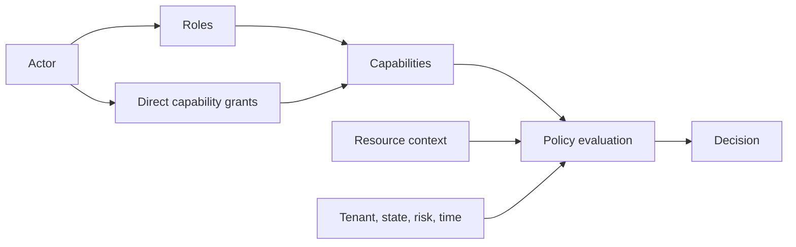
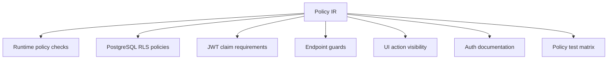

# Auth Model

The redesigned EvoBase treats authorization as a domain concept. JWT and
PostgreSQL RLS remain useful enforcement tools, but they are generated from a
domain authorization model rather than hand-authored as the core design.

Related documents:

- [02_domain_language.md](02_domain_language.md)
- [05_domain_ir.md](05_domain_ir.md)
- [06_workflow_system.md](06_workflow_system.md)
- [09_generator_architecture.md](09_generator_architecture.md)

## Current Baseline

Current EvoBase has:

- JWT authentication.
- access, refresh, and notification tokens.
- request-scoped PostgreSQL claim forwarding.
- PostgreSQL row-level security.
- an admin token for admin endpoints.

The redesign keeps these primitives but moves policy authorship into the domain
model.

## Core Concepts

### Actor

An actor is the subject attempting an action.

Examples:

- authenticated user.
- service account.
- admin operator.
- external integration.
- scheduled job.

Actor metadata may include:

- actor ID.
- actor kind.
- verified user evidence.
- tenant or workspace membership.
- active role set.
- capability grants.
- JWT claims.
- session risk signals.

### Role

A role is a named collection of default capabilities.

Examples:

- buyer.
- warehouse_operator.
- support_agent.
- workspace_admin.

Roles are useful for administration, but they should not be the only
authorization mechanism. Role-only designs become brittle when exceptions,
delegation, resource ownership, and contextual rules appear.

### Capability

A capability is the authority to attempt a category of action.

Examples:

- `pay_order`.
- `ship_order`.
- `read_customer_profile`.
- `manage_workspace_members`.

Capabilities can be granted by role, direct assignment, delegation, or system
rule. Having a capability does not always mean the action is allowed. A policy
still evaluates context.

### Policy

A policy decides whether an actor may perform an action on a resource in a
context.

Example:

```text
buyer_can_pay_order:
  actor must have pay_order capability
  actor must be the order buyer
  order must be DraftOrder
  actor must be VerifiedUserId
```

Policy result:

- allow.
- deny.
- deny with reason.
- require additional verification.
- require delegation approval.

### Permission

A permission is the generated enforcement unit for a policy decision. It may
become:

- runtime policy function.
- RLS predicate.
- endpoint guard.
- UI action availability rule.
- documentation entry.

### Resource

A resource is the object protected by policy:

- aggregate root.
- entity.
- read model.
- command.
- event stream.
- admin operation.

Resources should be domain concepts, not raw database tables.

## Capability-Based Authorization

RBAC answers "what role does this actor have?" Capability-based authorization
answers "what can this actor do?" Policy then answers "can they do it here,
now, to this resource?"



Benefits:

- supports delegation.
- supports service accounts.
- supports temporary grants.
- supports resource-specific checks.
- avoids role explosion.
- maps cleanly to generated UI actions.

## Policy Inputs

Policies may depend on:

- actor identity.
- actor verification state.
- role membership.
- capability grants.
- resource owner.
- aggregate state.
- workflow state.
- tenant/workspace membership.
- request origin.
- time window.
- risk score.
- external authorization facts.

The IR should classify policy inputs by enforcement target. Some can be
represented in PostgreSQL RLS. Others must run in the generated policy layer.

## Generated Policy Artifacts



### Runtime Policy Checks

Runtime checks are used when policy depends on:

- command payload.
- workflow transition.
- external service state.
- complex capability delegation.
- risk calculations.
- multi-resource decisions.

### PostgreSQL RLS

RLS remains a strong enforcement tool for row-level data access. Generated RLS
is appropriate when policy can be expressed from:

- actor ID.
- tenant ID.
- role or capability claim.
- row ownership.
- row workflow state.
- stable PostgreSQL functions.

RLS should not be the only representation of policy. It is one target generated
from the domain policy graph.

### JWT Claims

JWTs should carry claims needed for efficient request authorization:

- actor ID.
- actor kind.
- tenant or workspace IDs.
- role IDs.
- capability summary or version.
- verification status where safe.

Claims are evidence, not unquestionable truth. Critical status such as
`VerifiedUserId` may require database-backed confirmation or revocation-aware
checks.

## Policy And Workflows

Workflow transitions should require policies:

| Command | Workflow State | Required Policy |
| --- | --- | --- |
| `PayOrder` | `DraftOrder` | buyer can pay own draft order |
| `ShipOrder` | `PaidOrder` | warehouse actor can ship paid order |
| `CancelOrder` | `DraftOrder` or `PaidOrder` | buyer or support can cancel |

The workflow graph defines possible transitions. The policy graph defines who
may execute them.

## Policy And Read Models

Read authorization is not always the same as write authorization:

- buyer can read own order summary.
- support can read customer timeline for assigned accounts.
- analyst can read anonymized aggregate projections.
- admin can read audit trails only with specific capability.

Read models should carry policy metadata. Public read endpoints must not be
generated without an explicit policy or public marker.

## Deny By Default

The auth generator should be deny-by-default:

- no command endpoint without policy.
- no read model exposure without policy.
- no event stream subscription without policy.
- no admin UI action without policy.

Explicit public access must be declared as a policy decision, not implied by
absence of auth.

## RLS Mapping

Example policy:

```text
buyer_can_read_order:
  actor.id == order.buyer_id
  actor.tenant_id == order.tenant_id
```

Potential generated RLS:

```text
USING (
  buyer_id = current_actor_id()
  AND tenant_id = current_tenant_id()
)
```

This is illustrative only. The generator decides concrete SQL.

## Capability Revocation

Capability grants should be revocable. JWTs complicate revocation because they
can be valid until expiration. EvoBase should support:

- short-lived access tokens.
- capability version claims.
- server-side capability lookup for critical actions.
- revocation lists for high-risk sessions.
- generated policy checks that can force fresh capability state.

## Auditing

Authorization decisions should be auditable:

- actor.
- resource.
- command or query.
- decision.
- policy evaluated.
- capability source.
- denial reason.
- generated artifact version.

Audit metadata helps explain why a generated endpoint allowed or denied an
action.

## Verification Opportunities

Lean4 can verify policy properties at an abstract level:

- every public command has a policy.
- no actor lacking a required capability can pass a capability-only policy.
- tenant isolation policies include tenant equality.
- workflow-protected commands require source state constraints.

Not all policies are decidable in Lean4 if they depend on external systems, but
the structure and required guards can still be verified.

## Tradeoffs

### Capability Systems Need Good UX

Capabilities are more precise than roles, but they can overwhelm admins if
exposed raw. The low-code/admin UI should present roles, presets, and policy
explanations while keeping capability semantics underneath.

### RLS Is Powerful But Hard To Debug

Generated RLS must be explainable. Docs should show which domain policy created
each RLS policy.

### Claims Can Drift

JWT claims may become stale. Critical capabilities should be versioned or
checked server-side.

## Design Rule

Roles are for humans to manage. Capabilities and policies are for the platform
to enforce.
