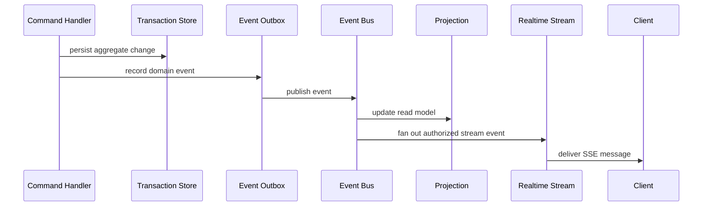
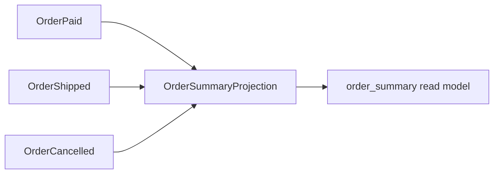

# Messaging Model

Messaging in the redesigned EvoBase is domain-event based. It is not a generic
notification pipe.

```text
Domain Event -> Event Bus -> Projection -> Realtime Stream -> Client
```

Related documents:

- [02_domain_language.md](02_domain_language.md)
- [05_domain_ir.md](05_domain_ir.md)
- [06_workflow_system.md](06_workflow_system.md)
- [09_generator_architecture.md](09_generator_architecture.md)

## Current Baseline

Current EvoBase includes:

- in-memory SSE notification hub.
- authenticated SSE connections.
- direct message send endpoint.
- offline in-memory relay queue.

The redesigned platform should retain simple SSE delivery as an initial runtime
target, but the source of messages should become domain events.

## Domain Events

A domain event is a fact that already happened.

Examples:

- `UserRegistered`.
- `EmailVerified`.
- `OrderPaid`.
- `OrderShipped`.
- `OrderCancelled`.
- `InventoryReserved`.

An event has:

- name.
- version.
- payload type.
- source aggregate or workflow.
- causation command.
- correlation ID.
- actor context.
- occurred timestamp.
- idempotency key.
- visibility policy.

Events must be declared in the domain model and represented in the Event Graph
inside the Domain IR.

## Event Flow



The outbox pattern should be the default for reliable event publication because
it ties event creation to state changes.

## Event Bus

The event bus is the internal transport for domain events. It should abstract
over delivery targets:

- in-process bus for development.
- PostgreSQL-backed outbox polling.
- SSE fan-out for realtime clients.
- future Kafka or NATS integration.
- projection workers.

The bus does not define domain meaning. It transports events defined by the IR.

## Projections

Projections subscribe to events and update read models:



Projection metadata:

- subscribed events.
- read model target.
- idempotency strategy.
- ordering requirements.
- rebuild strategy.
- error handling policy.
- lag/freshness expectations.

Projection functions should be pure at the model level: event plus current
projection state produces new projection state. Runtime persistence is an
interpretation of that pure transition.

## Realtime Streams

Realtime streams expose authorized event views to clients.

SSE remains the first target:

- simple HTTP semantics.
- works well with current EvoBase direction.
- compatible with browsers and Flutter clients.
- lower operational complexity than WebSockets.

Generated stream contracts should define:

- stream name.
- event types included.
- payload schemas.
- authorization policy.
- replay behavior.
- ordering guarantees.
- heartbeat behavior.
- cursor format.

## Client Delivery

Client streams should receive event-shaped messages, not arbitrary blobs:

```text
event: order.paid.v1
data: { order_id, amount, paid_at, ... }
```

Generated client SDKs can use typed event unions so clients must handle known
event variants explicitly.

## Event Sourcing Compatibility

The architecture should be compatible with event sourcing, but not require it
for every domain.

Event sourcing means the event log is the primary source of truth and current
state is derived by folding events. EvoBase can support a spectrum:

| Mode | Source Of Truth | Event Use |
| --- | --- | --- |
| CRUD plus events | tables | integration and projections |
| event-carried state transfer | tables plus rich events | projection rebuild |
| event sourced aggregate | event log | aggregate reconstruction |

The Domain IR should record which mode each aggregate uses.

## Kafka Compatibility

Kafka compatibility should be planned through stable event contracts:

- topic naming strategy.
- event key strategy.
- schema versioning.
- partitioning strategy.
- ordering expectations.
- compacted vs append-only topics.
- consumer group semantics.

Kafka should be a generator target, not a source of domain semantics. The same
Event Graph that powers SSE should generate Kafka contracts later.

## Event Versioning

Events are contracts. They need versioning rules:

- adding optional fields is usually compatible.
- removing fields is breaking.
- changing meaning is breaking even if shape is unchanged.
- renaming fields requires compatibility mapping.
- changing identity keys affects ordering and projections.

The IR should store compatibility metadata and migration notes for event
versions.

## Event Visibility And Auth

Not every event should be visible to every subscriber.

Examples:

- buyer can subscribe to events about their own orders.
- warehouse can subscribe to shipment-ready orders.
- analytics can subscribe to anonymized aggregate events.
- internal security events are admin-only.

Generated stream policies should reuse the auth model in
[07_auth_model.md](07_auth_model.md).

## Event Contracts

Event contracts should generate:

- Rust event types.
- OpenAPI or async API documentation.
- JSON schema.
- SSE event names.
- projection input schemas.
- Kafka topic schema in the future.
- client SDK event unions.

The event contract must point back to the domain event IR node.

## Reliability

Reliability concerns:

- event persisted with state change.
- event delivered at least once internally.
- projections idempotent.
- subscribers can resume from cursor where supported.
- failed deliveries do not corrupt aggregate state.
- poison events are quarantined with diagnostics.

The first runtime can use simple mechanisms, but the architecture should not
encode "in-memory only" as the messaging model.

## Generated SQL

Possible generated persistence artifacts:

- event outbox table.
- event log table for event-sourced aggregates.
- projection checkpoint table.
- stream cursor table.
- idempotency key table.

These artifacts derive from event and projection metadata.

## Tradeoffs

### Events Add Modeling Work

Events require names, payloads, and versioning. This cost is justified when
other parts of the platform depend on those facts: projections, streams,
integrations, audit, and low-code automations.

### SSE Is Simple But Not Universal

SSE is a good first realtime target. It is not ideal for bidirectional client
communication. The event model should remain transport-independent so WebSocket
or Kafka targets can be added later.

### Event Sourcing Is Optional

Forcing event sourcing everywhere would make simple domains heavy. EvoBase
should support event-sourced aggregates where valuable, without requiring it
for all entities.

## Design Rule

If a message matters to the business, model it as a domain event. If it does
not matter to the business, keep it out of the domain event graph.
