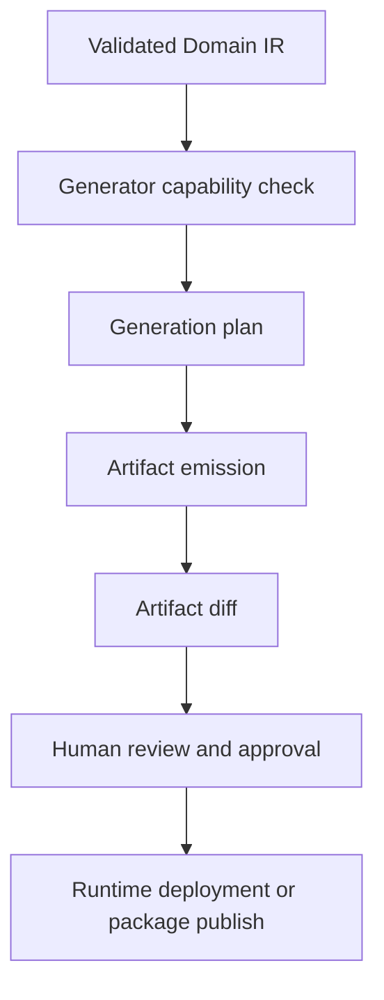
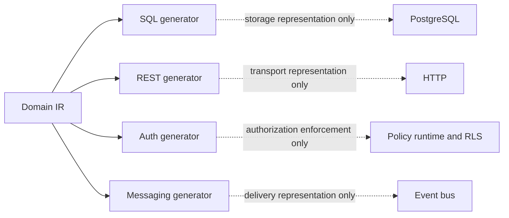

# Generator Architecture

Generators turn the validated Domain IR into runtime artifacts. They are
interpreters of the domain model, not independent sources of truth.

Related documents:

- [01_architecture_overview.md](01_architecture_overview.md)
- [02_domain_language.md](02_domain_language.md)
- [05_domain_ir.md](05_domain_ir.md)
- [07_auth_model.md](07_auth_model.md)
- [08_messaging_model.md](08_messaging_model.md)

## Generator Principle

Every generator must:

- consume validated Domain IR.
- declare its supported IR features.
- produce deterministic artifacts.
- emit source maps back to IR nodes.
- report unsupported constructs clearly.
- avoid inventing domain semantics.

Generators can optimize and adapt representation for their target, but they
cannot reinterpret the meaning of a domain declaration.

## Generator Pipeline



The generation plan maps IR nodes to artifacts. This is necessary for
explainability:

```text
OrderPaid event -> outbox schema, SSE event contract, projection subscription,
OpenAPI docs, generated client event type
```

## SQL Generator

The SQL generator emits PostgreSQL artifacts:

- schemas.
- tables.
- columns.
- primary keys.
- foreign keys.
- indexes.
- domains.
- enum types.
- check constraints.
- generated columns.
- views.
- materialized views.
- outbox tables.
- projection tables.
- migration scripts.

SQL generation should be derived from:

- entity graph.
- type graph.
- refinement metadata.
- workflow graph.
- policy graph.
- event graph.
- projection graph.

Important boundary:

- SQL generator decides persistence representation.
- It does not decide whether a command exists.
- It does not define domain events.
- It does not create policy semantics beyond translating Policy IR.

## Migration Generator

Migrations are not merely schema diffs. They must understand domain changes:

- adding entity fields.
- changing refinements.
- renaming types.
- splitting workflows states.
- changing event payloads.
- modifying authorization rules.
- introducing projections.

Migration generation should classify changes:

- safe additive.
- data backfill required.
- policy review required.
- breaking API change.
- proof required.
- manual intervention required.

Migration artifacts should include:

- SQL migration.
- preflight checks.
- rollback strategy where possible.
- data migration notes.
- generated compatibility report.

See [13_migration_strategy.md](13_migration_strategy.md).

## REST Generator

The REST generator emits domain-oriented endpoints:

- command endpoints.
- query endpoints.
- workflow transition endpoints.
- read model endpoints.
- health and metadata endpoints where needed.

It should avoid exposing every table by default. Public API shape is derived
from commands, queries, workflows, and read models.

Example mapping:

| Domain Node | REST Artifact |
| --- | --- |
| `PayOrder` command | `POST /orders/{id}/pay` |
| `ShipOrder` command | `POST /orders/{id}/ship` |
| `OrderSummary` read model | `GET /orders` and `GET /orders/{id}` |
| `CustomerTimeline` query | `GET /customers/{id}/timeline` |

The generator should produce:

- routes.
- request schemas.
- response schemas.
- error schemas.
- policy hooks.
- input validators.
- event publication hooks.

## OpenAPI Generator

The OpenAPI generator emits:

- endpoint documentation.
- request and response schemas.
- refined scalar schemas.
- auth requirements.
- error codes.
- workflow transition metadata.
- event stream links where supported.

OpenAPI should reflect domain commands and read models, not raw persistence
tables.

## Documentation Generator

The docs generator emits human-readable domain documentation:

- entities.
- value objects.
- refinements.
- workflows.
- commands.
- queries.
- policies.
- events.
- projections.
- generated artifacts.
- proof status.
- enforcement matrix.

Documentation should explain why a rule exists, not only what fields exist.

## Auth Generator

The auth generator emits:

- runtime policy checks.
- capability definitions.
- role capability presets.
- JWT claim requirements.
- PostgreSQL RLS policies.
- endpoint guards.
- stream subscription guards.
- UI action visibility metadata.
- policy test matrix.

Boundaries:

- It consumes Policy IR.
- It does not infer public access from missing policies.
- It must be deny-by-default.
- It must indicate which policies cannot be fully represented in RLS.

See [07_auth_model.md](07_auth_model.md).

## Messaging Contracts Generator

The messaging generator emits:

- event schema contracts.
- outbox table definition.
- SSE event names.
- stream contracts.
- projection subscriptions.
- event version compatibility docs.
- future Kafka topic contracts.

Boundaries:

- It consumes Event Graph and Projection Graph.
- It does not allow arbitrary notification payloads as domain events.
- It must preserve event versioning metadata.

See [08_messaging_model.md](08_messaging_model.md).

## Admin UI Generator

The admin UI generator emits metadata for operational screens:

- entity management where allowed.
- read model browsing.
- workflow action panels.
- policy and capability management.
- audit views.
- event stream inspection.
- projection health.
- migration review.

Admin UI generation must respect policies. Administrative visibility is not
universal by default.

## Low-Code UI Generator

The low-code UI generator emits metadata for business-facing domain editing and
operations:

- forms derived from commands.
- state-aware action buttons.
- list/detail screens from read models.
- validation rules from refinements.
- permissions from policies.
- event-driven activity timelines.
- workflow diagrams.

The low-code UI should not bypass domain packages. It edits structured domain
concepts or invokes generated commands.

See [10_low_code_platform.md](10_low_code_platform.md).

## Workflow Runtime Generator

The workflow runtime generator emits:

- transition dispatch metadata.
- source-state validators.
- target-state persistence plan.
- guard evaluation plan.
- event emission plan.
- idempotency strategy.
- transition history recording.

Boundaries:

- It consumes Workflow Graph.
- It does not invent transitions.
- It must reject commands that do not match current state.

See [06_workflow_system.md](06_workflow_system.md).

## Generator Boundaries



Each generator owns representation details for its target. No generator owns the
domain.

## Determinism And Diffs

Generated artifacts must be stable:

- deterministic ordering.
- stable naming.
- stable formatting.
- explicit version headers.
- source maps.
- generator version metadata.

This makes generated diffs reviewable and reduces noise in migrations.

## Artifact Provenance

Every generated artifact should carry:

- domain package version.
- IR schema version.
- generator name and version.
- source node IDs.
- proof status where relevant.
- generation timestamp if needed outside deterministic files.

For deterministic files, timestamps should be avoided unless stored separately.

## Unsupported Features

When a generator cannot support an IR feature, it should report:

- unsupported feature.
- affected domain nodes.
- reason.
- possible fallback.
- whether generation is blocked.

Example:

```text
SQL generator cannot fully enforce EmailMxRecordExists refinement.
Runtime validator can enforce it with external DNS lookup.
SQL artifact will mark this refinement as not database-enforced.
```

## Testing Strategy

Generator verification should include:

- golden artifact tests.
- IR-to-artifact source map tests.
- unsupported feature tests.
- migration diff tests.
- policy enforcement matrix tests.
- event contract compatibility tests.
- property tests for deterministic output.

Critical generator laws may be specified in Lean4 at an abstract level. See
[04_lean4_verification.md](04_lean4_verification.md).

## Design Rule

A generator is a functor-like interpretation from Domain IR into a target
artifact category. If it changes the domain meaning, it is not a generator
anymore. It is a competing source of truth.
