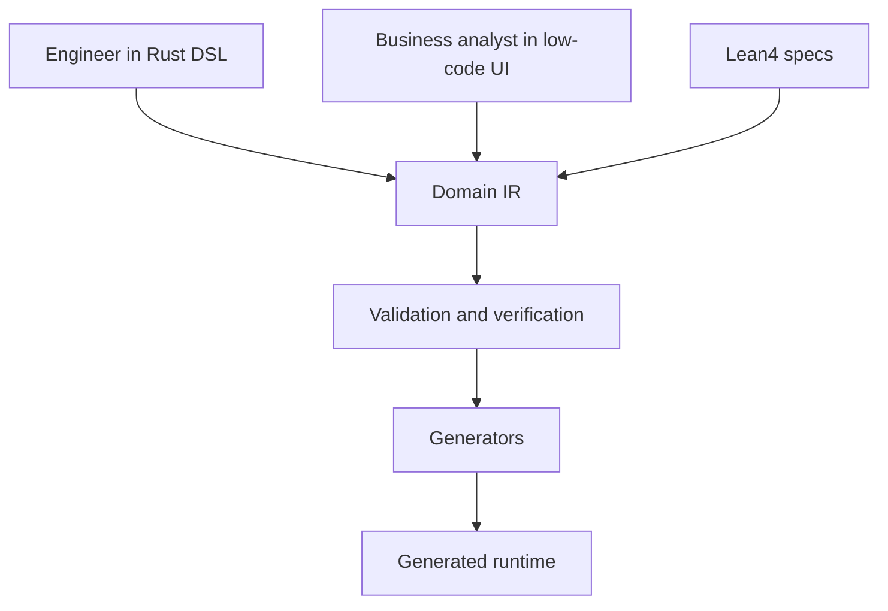
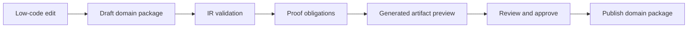

# Low-Code Platform Vision

The redesigned EvoBase should become a domain definition platform, not merely a
backend framework.

Related documents:

- [00_vision.md](00_vision.md)
- [02_domain_language.md](02_domain_language.md)
- [05_domain_ir.md](05_domain_ir.md)
- [09_generator_architecture.md](09_generator_architecture.md)

## Backend Framework vs Domain Definition Platform

A backend framework helps engineers write runtime code:

- handlers.
- models.
- migrations.
- auth checks.
- events.
- documentation.
- admin screens.

A domain definition platform helps teams define business systems:

- entities.
- value objects.
- workflows.
- commands.
- policies.
- events.
- read models.
- generated interfaces.

Runtime artifacts are generated from the domain model.

## Why Low-Code Belongs Here

Low-code often fails when it becomes an untyped island of configuration. EvoBase
can avoid that by making the verified domain model the foundation of low-code
authoring.

The low-code UI should never be a separate truth. It should edit the same model
that Rust DSL authors edit and that generators consume.

## Business Analyst Experience

A business analyst should eventually be able to:

- define entities and fields using domain vocabulary.
- choose refinements from a verified catalog.
- define workflows using state diagrams.
- define commands and forms.
- define read models for operational screens.
- configure policies through capability and ownership rules.
- subscribe projections to events.
- review generated docs.
- see validation diagnostics in business language.

They should not need to:

- write SQL.
- hand-code REST handlers.
- understand RLS syntax.
- write Kafka schemas.
- manually update OpenAPI docs.
- duplicate validation rules across UI and backend.

## Engineer Experience

Engineers remain essential. They define:

- reusable refinement libraries.
- Lean4 specifications and proofs.
- generator targets.
- integration boundaries.
- escape hatches.
- domain package review workflows.
- operational deployment.

The best platform lets engineers raise the semantic level for everyone else.

## Low-Code Safety Model

Low-code edits must pass the same validation gates:

Safety requirements:

- no direct production mutation of generated artifacts.
- no bypassing policy validation.
- no public endpoint without policy.
- no destructive migration without review.
- no weakening critical refinement without migration plan.
- no event breaking change without compatibility decision.

## Generated UI Types

### Domain Modeling UI

For creating and editing domain concepts:

- entity designer.
- value object designer.
- refinement picker.
- aggregate boundary editor.
- workflow state diagram.
- policy builder.
- event contract editor.
- projection builder.

### Operations UI

For operating generated systems:

- command forms.
- read model list/detail pages.
- workflow action panels.
- activity timelines.
- audit views.
- event stream monitor.
- projection health.

### Admin UI

For platform administration:

- package versions.
- migrations.
- actor and capability management.
- policy previews.
- generator outputs.
- deployment environments.

## Preserving Guarantees

Low-code UI controls should be generated from the same IR metadata:

| Domain Concept | Low-Code Control |
| --- | --- |
| `NonEmptyString` | required text input |
| `PositiveInt` | numeric input with lower bound |
| `Money<Usd>` | decimal amount plus fixed currency |
| workflow transition | state-aware action button |
| policy | action visibility and denial explanation |
| event | activity timeline item |
| read model | table/detail page |

The UI is not the authority. It is an interpretation of the verified domain
model.

## Collaboration Workflow

Recommended lifecycle:

1. Engineer creates base domain package with verified primitives.
2. Analyst edits workflow, forms, read models, or policy presets in a draft.
3. EvoBase validates the draft and shows diagnostics.
4. Generated artifacts are previewed as diffs.
5. Engineer reviews proof obligations and migration risk.
6. Package is published.
7. Runtime artifacts are generated and deployed.

## Versioning

Low-code changes must be versioned:

- draft version.
- review version.
- published version.
- deployed version.
- rollback target.

Generated runtime should know which domain package version produced it.

## Explainability

The platform must answer:

- Why does this field reject my input?
- Why can this actor not execute this command?
- Which policy generated this RLS rule?
- Which workflow transition generated this button?
- Which domain event updates this read model?
- Which migration will be applied if I publish?

Explainability is a product feature, not just a developer convenience.

## Escape Hatches

Some systems need custom behavior. Escape hatches should exist but be governed:

- custom validators.
- custom policy predicates.
- custom projection logic.
- custom generated endpoint adapters.
- custom SQL views.

Each escape hatch should declare:

- domain node affected.
- verification status.
- generator target affected.
- review requirement.
- test requirement.

The platform should make escape hatches explicit rather than hiding them in
runtime code.

## Tradeoffs

### Low-Code Requires Strong Modeling

Weak domain models produce weak low-code tools. The investment in the Domain IR
is what makes low-code safe.

### Analysts Need Guardrails

The UI should guide users toward valid concepts. It should not expose every
internal option. Advanced edits may require engineer approval.

### Generated UI Is Not Always Enough

Custom product experiences may still need hand-built frontends. EvoBase should
generate contracts and clients for those frontends too.

## Design Rule

Low-code is safe only when the code it avoids would have been generated from a
verified domain model anyway.
