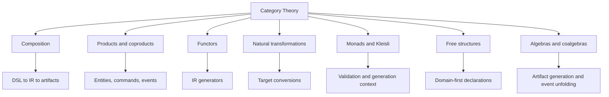

# Category Theory Mapping

This document explains category theory concepts as practical architecture
tools for EvoBase. The goal is not academic completeness. Each concept is tied
to how the platform models domains, validates them, and generates artifacts.

Related documents:

- [05_domain_ir.md](05_domain_ir.md)
- [09_generator_architecture.md](09_generator_architecture.md)
- [12_functional_programming_mapping.md](12_functional_programming_mapping.md)

## Practical Mapping

| Category Theory | EvoBase Architecture |
| --- | --- |
| objects | domain types, IR nodes, artifact types |
| morphisms | transformations, validators, workflow transitions |
| composition | pipelines from DSL to IR to artifacts |
| products | records, entities, command payloads |
| coproducts | enums, event unions, workflow state alternatives |
| functor | generator from IR to target artifacts |
| natural transformation | conversion between generator interpretations |
| monad | sequenced computations with context or effects |
| Kleisli category | validation/generation functions that may fail |
| adjunction | free declarative model and interpreted runtime relation |
| free structure | domain declarations before interpretation |
| F-algebra | folding IR into artifacts |
| coalgebra | unfolding runtime state into observations/events |
| Lawvere theory | algebraic operations and laws of the domain DSL |

## Composition

Composition means building larger transformations from smaller ones.

EvoBase pipelines are compositional:

```text
Rust source -> AST -> Domain IR -> validated IR -> generation plan -> artifacts
```

Each step has a clear input and output. This makes the system easier to reason
about, test, and replace.

Practical benefit:

- validators can be composed.
- generators can be staged.
- diagnostics can point to the stage where meaning changed.

## Products

Products correspond to "both this and that" structures. In programming, these
are records, structs, tuples, and entities.

Examples:

- `User = UserId x Email x UserStatus`.
- `PayOrder = OrderId x PaymentId x Money`.
- `PolicyContext = Actor x Resource x Environment`.

EvoBase uses products for:

- entity fields.
- command payloads.
- event payloads.
- value objects.
- read models.

Practical benefit:

- generated SQL rows map naturally from products.
- OpenAPI object schemas map naturally from products.
- validation can accumulate field-level errors.

## Coproducts

Coproducts correspond to "one of these alternatives." In programming, these
are enums, variants, unions, and sum types.

Examples:

- `OrderState = Draft | Paid | Shipped | Cancelled`.
- `DomainEvent = OrderPaid | OrderShipped | OrderCancelled`.
- `PolicyDecision = Allow | Deny | RequireStepUp`.

EvoBase uses coproducts for:

- workflow states.
- domain event unions.
- command result variants.
- error codes.
- policy decisions.

Practical benefit:

- clients can handle event variants explicitly.
- workflows can enumerate valid states.
- generated docs can show all alternatives.

## Functor

A functor maps objects and morphisms from one category to another while
preserving structure.

In EvoBase, a generator is functor-like:

```text
Domain IR -> SQL artifacts
Domain IR -> OpenAPI artifacts
Domain IR -> UI metadata
Domain IR -> Messaging contracts
```

It maps:

- domain types to target types.
- relationships to target references.
- constraints to target validators.
- transitions to target endpoints.

Practical benefit:

- each generator is an interpretation of the same model.
- generator correctness can be discussed as preservation of structure.
- unsupported mappings are explicit.

## Natural Transformation

A natural transformation converts one functor interpretation to another in a
structure-preserving way.

Practical EvoBase examples:

- converting REST API schema generation to client SDK schema generation.
- converting event contracts from SSE format to Kafka schema format.
- converting SQL projection representation to UI read-model representation.

The point is that these conversions should preserve the underlying event,
command, or type meaning.

## Monad

A monad sequences computations that carry context, effects, or failure.

EvoBase uses monadic patterns conceptually for:

- validation that may fail.
- generation that accumulates diagnostics.
- policy evaluation with context.
- migration planning with state.
- workflow execution with transaction effects.

Example:

```text
parse -> validate -> authorize -> execute -> emit event
```

Each step depends on the previous result and may fail. The monad gives a
structured way to sequence these steps without losing errors or context.

## Kleisli Category

The Kleisli category is useful for composing functions that return values in a
context, such as `Result<T, Error>` or `Validation<T>`.

EvoBase validators are Kleisli-like:

```text
DomainIR -> Validation<DomainIR>
DomainIR -> Result<GenerationPlan, Diagnostics>
RawInput -> Result<RefinedValue, ValidationError>
```

Practical benefit:

- failure-aware functions compose cleanly.
- diagnostics remain explicit.
- the pipeline can stop or accumulate based on validation mode.

## Adjunction

An adjunction often appears as a relationship between a free/declarative world
and an interpreted/constrained world.

Practical EvoBase mapping:

- free side: domain declarations as pure intent.
- interpreted side: generated runtime artifacts with target constraints.

The architecture repeatedly asks:

```text
What is the most general domain declaration?
What is the best target-specific interpretation?
```

Example:

- Domain says `Email`.
- SQL interpretation may be a text column plus check constraint.
- OpenAPI interpretation may be string format email.
- UI interpretation may be email input with validation.

The target interpretation is less general than the domain concept, but it is
connected by a disciplined mapping.

## Free Structures

Free structures represent declarations before choosing an interpretation.

The Domain IR should be as free as practical:

- define events before choosing SSE or Kafka.
- define policies before choosing RLS or runtime checks.
- define workflows before choosing endpoint shapes.
- define read models before choosing views or materialized tables.

Practical benefit:

- multiple generators can interpret the same declaration.
- new runtime targets can be added later.
- domain meaning is not trapped inside PostgreSQL-specific syntax.

## F-Algebras

An F-algebra folds a structured value into a result.

Generator passes are algebra-like folds over the IR:

- fold type graph into SQL type declarations.
- fold policy graph into RLS policies.
- fold workflow graph into endpoints.
- fold event graph into stream contracts.

Practical benefit:

- generation can be organized as a traversal with clear combination rules.
- recursive structures such as nested value objects are handled systematically.

## Coalgebras

Coalgebras unfold state into observations or next states.

EvoBase examples:

- runtime workflow state unfolds into available next transitions.
- event stream unfolds aggregate changes into client-visible facts.
- projection rebuild unfolds event log into read model states.

Practical benefit:

- good fit for streams, state machines, and event sourcing compatibility.

## Lawvere Theories

Lawvere theories model algebraic operations and equations.

Practical EvoBase mapping:

- domain DSL operations have laws.
- money addition is associative for same currency.
- workflow composition obeys declared transition graph.
- policy combination has identity and precedence laws.
- validators compose according to accumulation rules.

These laws should be documented, tested, and for critical pieces specified in
Lean4.

## Category Theory To EvoBase Summary



## Design Rule

Use category theory as an architectural lens only when it improves structure:
clear composition, preserved meaning, lawful generation, and explicit
interpretation boundaries.
